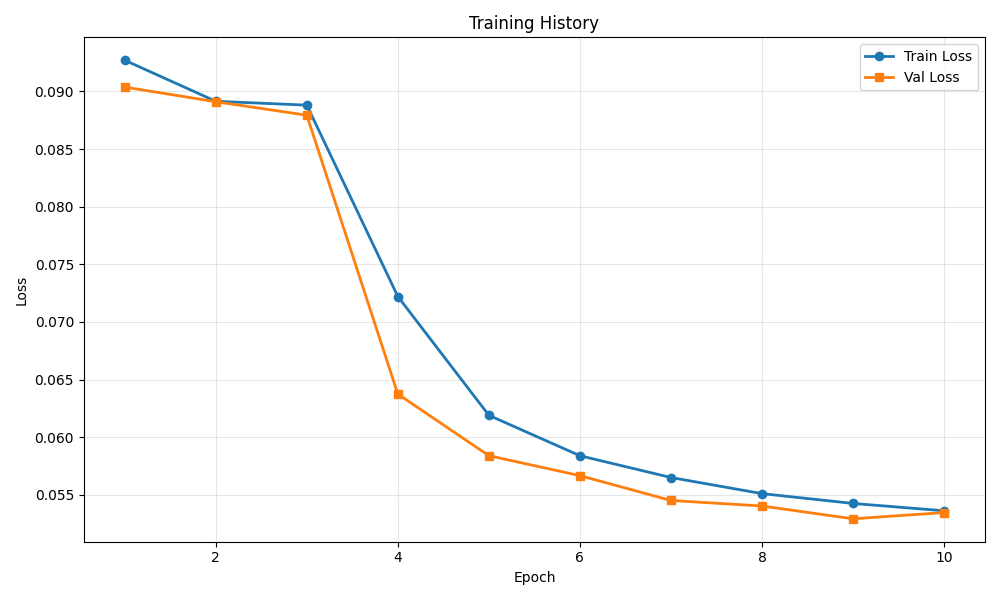
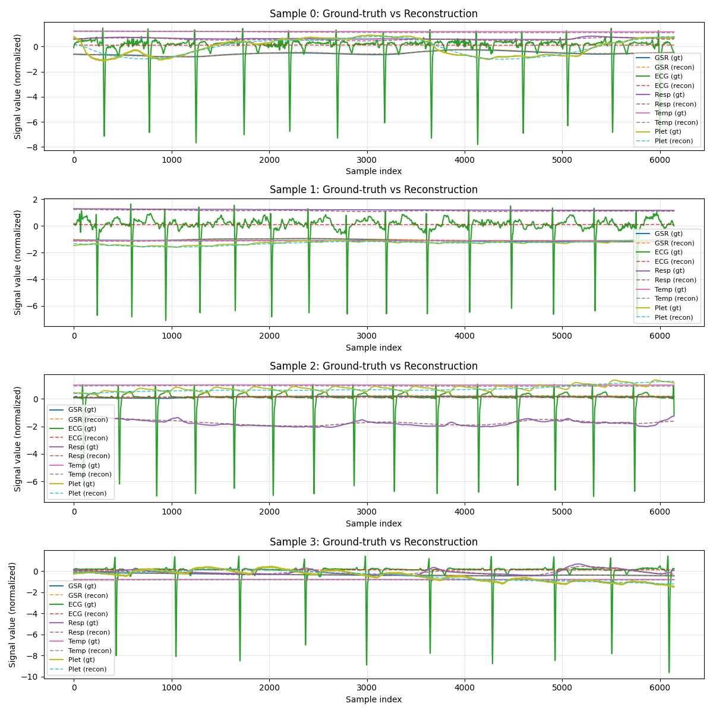

# Training Run Report

**Date:** 2025-12-05 15:58:26

## 💡 Notes / Goal

let's compare if replacing l1 by Hubert improve something?

## 🚀 Command

```bash
main.py --use-eatmint --epochs 10 --batch-size 8 --target-fs 512 --latent-dim 128 --num-latents 128 --diff-loss-weight 0.3 --no-residual --run-name Hubert loss --comment let's compare if replacing l1 by Hubert improve something?
```

## ⚙️ Configuration

| Parameter | Value |
|-----------|-------|
| `batch_size` | `8` |
| `comment` | `let's compare if replacing l1 by Hubert improve something?` |
| `data_root` | `../data/EATMINT/researchdata` |
| `decoder_len` | `None` |
| `device` | `None` |
| `diff_loss_weight` | `0.3` |
| `downsample_strategy` | `polyphase` |
| `dropout` | `0.05` |
| `epochs` | `10` |
| `fourier_bands` | `32` |
| `hop_size` | `6.0` |
| `latent_dim` | `128` |
| `lr` | `0.0001` |
| `max_freq_hz` | `None` |
| `min_freq_hz` | `None` |
| `no_residual` | `True` |
| `num_heads` | `8` |
| `num_latents` | `128` |
| `num_signals` | `5` |
| `num_windows` | `200` |
| `num_workers` | `0` |
| `physio_fs` | `512.0` |
| `preload` | `False` |
| `run_name` | `Hubert loss` |
| `seed` | `0` |
| `self_layers` | `4` |
| `smoothing_kernel` | `0` |
| `target_fs` | `512.0` |
| `use_eatmint` | `True` |
| `val_fraction` | `0.1` |
| `window_size` | `12.0` |

## 📊 Training Results

- **Final Train Loss:** 0.053618
- **Final Val Loss:** 0.053464
- **Best Train Loss:** 0.053618
- **Best Val Loss:** 0.052924
- **Total Epochs:** 10

### Epoch-by-Epoch History

| Epoch | Train Loss | Val Loss |
|-------|------------|----------|
| 1 | 0.092710 | 0.090381 |
| 2 | 0.089151 | 0.089112 |
| 3 | 0.088815 | 0.087941 |
| 4 | 0.072211 | 0.063746 |
| 5 | 0.061904 | 0.058400 |
| 6 | 0.058397 | 0.056669 |
| 7 | 0.056507 | 0.054516 |
| 8 | 0.055108 | 0.054035 |
| 9 | 0.054257 | 0.052924 |
| 10 | 0.053618 | 0.053464 |

## 📈 Additional Metrics

- **total_parameters:** 1224197

## 📷 Visualizations

### Training History



### Reconstruction Examples



## 💾 Checkpoint

Saved to: `checkpoint.pt`

## 📁 Files

- `checkpoint.pt` (14441.3 KB)
- `reconstruction.png` (370.8 KB)
- `training_history.png` (45.1 KB)
