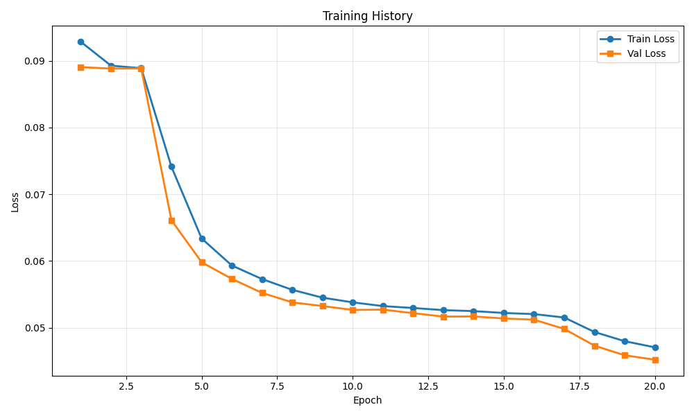
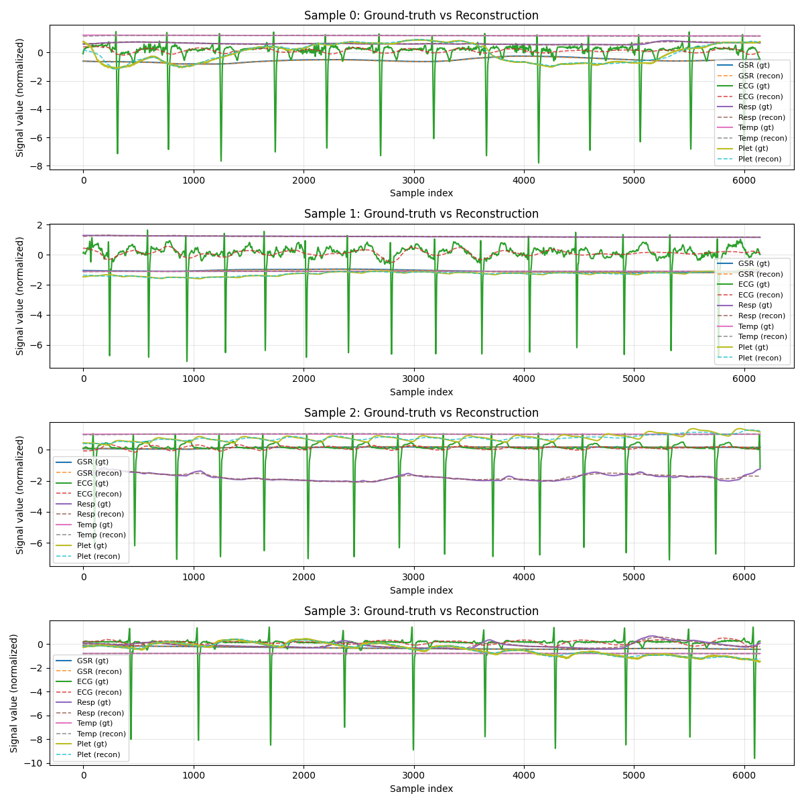

# Training Run Report

**Date:** 2025-12-05 17:27:20

## 💡 Notes / Goal

let's compare if replacing l1 by Hubert improve something, 32 latent?

## 🚀 Command

```bash
main.py --use-eatmint --epochs 20 --batch-size 8 --target-fs 512 --latent-dim 128 --num-latents 32 --diff-loss-weight 0.3 --no-residual --run-name Hubert loss --comment let's compare if replacing l1 by Hubert improve something, 32 latent?
```

## ⚙️ Configuration

| Parameter | Value |
|-----------|-------|
| `batch_size` | `8` |
| `comment` | `let's compare if replacing l1 by Hubert improve something, 32 latent?` |
| `data_root` | `../data/EATMINT/researchdata` |
| `decoder_len` | `None` |
| `device` | `None` |
| `diff_loss_weight` | `0.3` |
| `downsample_strategy` | `polyphase` |
| `dropout` | `0.05` |
| `epochs` | `20` |
| `fourier_bands` | `32` |
| `hop_size` | `6.0` |
| `latent_dim` | `128` |
| `lr` | `0.0001` |
| `max_freq_hz` | `None` |
| `min_freq_hz` | `None` |
| `no_residual` | `True` |
| `num_heads` | `8` |
| `num_latents` | `32` |
| `num_signals` | `5` |
| `num_windows` | `200` |
| `num_workers` | `0` |
| `physio_fs` | `512.0` |
| `preload` | `False` |
| `run_name` | `Hubert loss` |
| `seed` | `0` |
| `self_layers` | `4` |
| `smoothing_kernel` | `0` |
| `target_fs` | `512.0` |
| `use_eatmint` | `True` |
| `val_fraction` | `0.1` |
| `window_size` | `12.0` |

## 📊 Training Results

- **Final Train Loss:** 0.047045
- **Final Val Loss:** 0.045192
- **Best Train Loss:** 0.047045
- **Best Val Loss:** 0.045192
- **Total Epochs:** 20

### Epoch-by-Epoch History

| Epoch | Train Loss | Val Loss |
|-------|------------|----------|
| 1 | 0.092849 | 0.089048 |
| 2 | 0.089272 | 0.088835 |
| 3 | 0.088894 | 0.088854 |
| 4 | 0.074118 | 0.066103 |
| 5 | 0.063366 | 0.059805 |
| 6 | 0.059315 | 0.057307 |
| 7 | 0.057278 | 0.055207 |
| 8 | 0.055665 | 0.053785 |
| 9 | 0.054490 | 0.053234 |
| 10 | 0.053787 | 0.052655 |
| 11 | 0.053228 | 0.052701 |
| 12 | 0.052944 | 0.052166 |
| 13 | 0.052621 | 0.051655 |
| 14 | 0.052476 | 0.051676 |
| 15 | 0.052198 | 0.051372 |
| 16 | 0.052026 | 0.051190 |
| 17 | 0.051517 | 0.049804 |
| 18 | 0.049345 | 0.047300 |
| 19 | 0.047966 | 0.045854 |
| 20 | 0.047045 | 0.045192 |

## 📈 Additional Metrics

- **total_parameters:** 1211909

## 📷 Visualizations

### Training History



### Reconstruction Examples



## 💾 Checkpoint

Saved to: `checkpoint.pt`

## 📁 Files

- `checkpoint.pt` (14297.7 KB)
- `reconstruction.png` (375.2 KB)
- `training_history.png` (42.1 KB)
