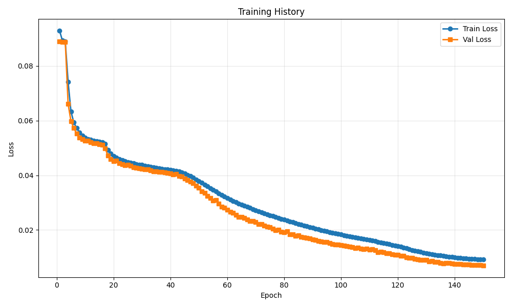
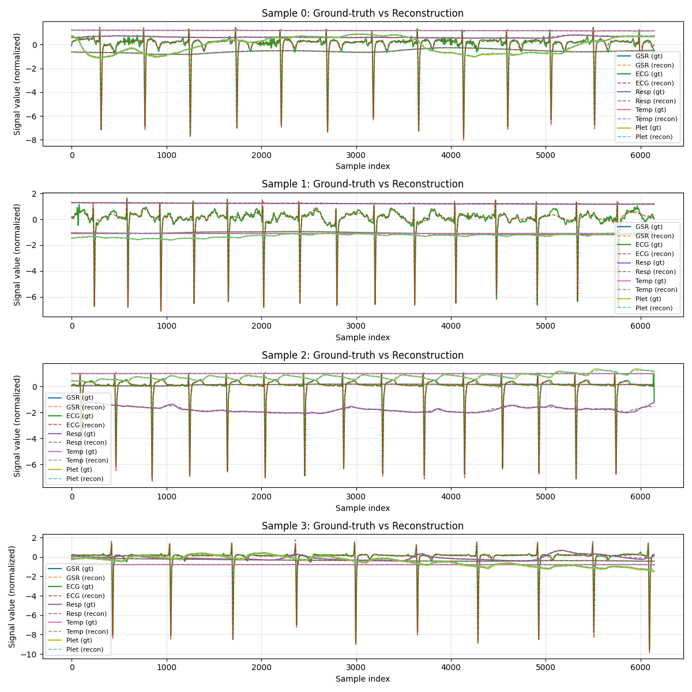

# Training Run Report

**Date:** 2025-12-07 03:43:07

## 💡 Notes / Goal

let s compare if replacing l1 by Hubert improve something, 32 latent?

## 🚀 Command

```bash
main.py --use-eatmint --epochs 150 --batch-size 8 --target-fs 512 --latent-dim 128 --num-latents 32 --diff-loss-weight 0.3 --no-residual --run-name Hubert50 --comment let s compare if replacing l1 by Hubert improve something, 32 latent?
```

## ⚙️ Configuration

| Parameter | Value |
|-----------|-------|
| `batch_size` | `8` |
| `comment` | `let s compare if replacing l1 by Hubert improve something, 32 latent?` |
| `data_root` | `../data/EATMINT/researchdata` |
| `decoder_len` | `None` |
| `device` | `None` |
| `diff_loss_weight` | `0.3` |
| `downsample_strategy` | `polyphase` |
| `dropout` | `0.05` |
| `epochs` | `150` |
| `fourier_bands` | `32` |
| `hop_size` | `6.0` |
| `latent_dim` | `128` |
| `lr` | `0.0001` |
| `max_freq_hz` | `None` |
| `min_freq_hz` | `None` |
| `no_residual` | `True` |
| `num_heads` | `8` |
| `num_latents` | `32` |
| `num_signals` | `5` |
| `num_windows` | `200` |
| `num_workers` | `0` |
| `physio_fs` | `512.0` |
| `preload` | `False` |
| `run_name` | `Hubert50` |
| `seed` | `0` |
| `self_layers` | `4` |
| `smoothing_kernel` | `0` |
| `target_fs` | `512.0` |
| `use_eatmint` | `True` |
| `val_fraction` | `0.1` |
| `window_size` | `12.0` |

## 📊 Training Results

- **Final Train Loss:** 0.009124
- **Final Val Loss:** 0.006999
- **Best Train Loss:** 0.009124
- **Best Val Loss:** 0.006999
- **Total Epochs:** 150

### Epoch-by-Epoch History

| Epoch | Train Loss | Val Loss |
|-------|------------|----------|
| 1 | 0.092849 | 0.089048 |
| 2 | 0.089272 | 0.088835 |
| 3 | 0.088894 | 0.088854 |
| 4 | 0.074118 | 0.066103 |
| 5 | 0.063366 | 0.059805 |
| 6 | 0.059315 | 0.057307 |
| 7 | 0.057278 | 0.055207 |
| 8 | 0.055665 | 0.053785 |
| 9 | 0.054490 | 0.053234 |
| 10 | 0.053787 | 0.052655 |
| 11 | 0.053228 | 0.052701 |
| 12 | 0.052944 | 0.052166 |
| 13 | 0.052621 | 0.051655 |
| 14 | 0.052476 | 0.051676 |
| 15 | 0.052198 | 0.051372 |
| 16 | 0.052026 | 0.051190 |
| 17 | 0.051517 | 0.049804 |
| 18 | 0.049345 | 0.047300 |
| 19 | 0.047966 | 0.045854 |
| 20 | 0.047045 | 0.045192 |
| 21 | 0.046413 | 0.045262 |
| 22 | 0.045853 | 0.044340 |
| 23 | 0.045503 | 0.044060 |
| 24 | 0.045150 | 0.043647 |
| 25 | 0.044804 | 0.043885 |
| 26 | 0.044566 | 0.043401 |
| 27 | 0.044330 | 0.042957 |
| 28 | 0.044094 | 0.042788 |
| 29 | 0.043911 | 0.042565 |
| 30 | 0.043751 | 0.042289 |
| 31 | 0.043504 | 0.042184 |
| 32 | 0.043296 | 0.042219 |
| 33 | 0.043049 | 0.041801 |
| 34 | 0.042868 | 0.041452 |
| 35 | 0.042719 | 0.041484 |
| 36 | 0.042547 | 0.041268 |
| 37 | 0.042383 | 0.041242 |
| 38 | 0.042243 | 0.041071 |
| 39 | 0.042103 | 0.040941 |
| 40 | 0.041965 | 0.040683 |
| 41 | 0.041811 | 0.040329 |
| 42 | 0.041618 | 0.040410 |
| 43 | 0.041352 | 0.039791 |
| 44 | 0.041036 | 0.039472 |
| 45 | 0.040653 | 0.038882 |
| 46 | 0.040178 | 0.038213 |
| 47 | 0.039677 | 0.037630 |
| 48 | 0.039080 | 0.037081 |
| 49 | 0.038488 | 0.036235 |
| 50 | 0.037933 | 0.035437 |
| 51 | 0.037294 | 0.034192 |
| 52 | 0.036619 | 0.033537 |
| 53 | 0.035958 | 0.032419 |
| 54 | 0.035298 | 0.031645 |
| 55 | 0.034663 | 0.030741 |
| 56 | 0.034034 | 0.030963 |
| 57 | 0.033399 | 0.029567 |
| 58 | 0.032823 | 0.028421 |
| 59 | 0.032215 | 0.028105 |
| 60 | 0.031701 | 0.027317 |
| 61 | 0.031078 | 0.026703 |
| 62 | 0.030541 | 0.026241 |
| 63 | 0.030114 | 0.025429 |
| 64 | 0.029619 | 0.024835 |
| 65 | 0.029199 | 0.024705 |
| 66 | 0.028807 | 0.024300 |
| 67 | 0.028399 | 0.023877 |
| 68 | 0.028027 | 0.023230 |
| 69 | 0.027603 | 0.023272 |
| 70 | 0.027212 | 0.022838 |
| 71 | 0.026870 | 0.022158 |
| 72 | 0.026502 | 0.022058 |
| 73 | 0.026106 | 0.021482 |
| 74 | 0.025754 | 0.021117 |
| 75 | 0.025388 | 0.021043 |
| 76 | 0.025091 | 0.020527 |
| 77 | 0.024714 | 0.019948 |
| 78 | 0.024457 | 0.020087 |
| 79 | 0.024091 | 0.019390 |
| 80 | 0.023789 | 0.019164 |
| 81 | 0.023462 | 0.019460 |
| 82 | 0.023149 | 0.018383 |
| 83 | 0.022844 | 0.018394 |
| 84 | 0.022512 | 0.017890 |
| 85 | 0.022219 | 0.018000 |
| 86 | 0.021909 | 0.017418 |
| 87 | 0.021624 | 0.017325 |
| 88 | 0.021327 | 0.017019 |
| 89 | 0.021041 | 0.016858 |
| 90 | 0.020740 | 0.016475 |
| 91 | 0.020440 | 0.016335 |
| 92 | 0.020198 | 0.015878 |
| 93 | 0.019939 | 0.015745 |
| 94 | 0.019687 | 0.015558 |
| 95 | 0.019432 | 0.015618 |
| 96 | 0.019206 | 0.015119 |
| 97 | 0.018967 | 0.014763 |
| 98 | 0.018738 | 0.014610 |
| 99 | 0.018503 | 0.014702 |
| 100 | 0.018291 | 0.014379 |
| 101 | 0.018064 | 0.014331 |
| 102 | 0.017846 | 0.014075 |
| 103 | 0.017653 | 0.013897 |
| 104 | 0.017443 | 0.013630 |
| 105 | 0.017225 | 0.013371 |
| 106 | 0.017015 | 0.013510 |
| 107 | 0.016825 | 0.013167 |
| 108 | 0.016642 | 0.012930 |
| 109 | 0.016461 | 0.013071 |
| 110 | 0.016248 | 0.012845 |
| 111 | 0.016074 | 0.013025 |
| 112 | 0.015884 | 0.012524 |
| 113 | 0.015655 | 0.011908 |
| 114 | 0.015470 | 0.012086 |
| 115 | 0.015215 | 0.011795 |
| 116 | 0.014977 | 0.011532 |
| 117 | 0.014774 | 0.011491 |
| 118 | 0.014534 | 0.011172 |
| 119 | 0.014298 | 0.010940 |
| 120 | 0.014066 | 0.010923 |
| 121 | 0.013811 | 0.010566 |
| 122 | 0.013565 | 0.010520 |
| 123 | 0.013283 | 0.009958 |
| 124 | 0.012964 | 0.009833 |
| 125 | 0.012658 | 0.009679 |
| 126 | 0.012374 | 0.009460 |
| 127 | 0.012162 | 0.009270 |
| 128 | 0.011925 | 0.009099 |
| 129 | 0.011705 | 0.008938 |
| 130 | 0.011511 | 0.009006 |
| 131 | 0.011312 | 0.008524 |
| 132 | 0.011086 | 0.008581 |
| 133 | 0.010901 | 0.008362 |
| 134 | 0.010721 | 0.008288 |
| 135 | 0.010614 | 0.007923 |
| 136 | 0.010449 | 0.007799 |
| 137 | 0.010309 | 0.007908 |
| 138 | 0.010173 | 0.007938 |
| 139 | 0.010093 | 0.007659 |
| 140 | 0.009953 | 0.007607 |
| 141 | 0.009832 | 0.007614 |
| 142 | 0.009724 | 0.007476 |
| 143 | 0.009644 | 0.007351 |
| 144 | 0.009565 | 0.007307 |
| 145 | 0.009485 | 0.007396 |
| 146 | 0.009386 | 0.007120 |
| 147 | 0.009325 | 0.007174 |
| 148 | 0.009232 | 0.007231 |
| 149 | 0.009143 | 0.007060 |
| 150 | 0.009124 | 0.006999 |

## 📈 Additional Metrics

- **total_parameters:** 1211909

## 📷 Visualizations

### Training History



### Reconstruction Examples



## 💾 Checkpoint

Saved to: `checkpoint.pt`

## 📁 Files

- `checkpoint.pt` (14303.1 KB)
- `reconstruction.png` (434.9 KB)
- `training_history.png` (29.8 KB)
