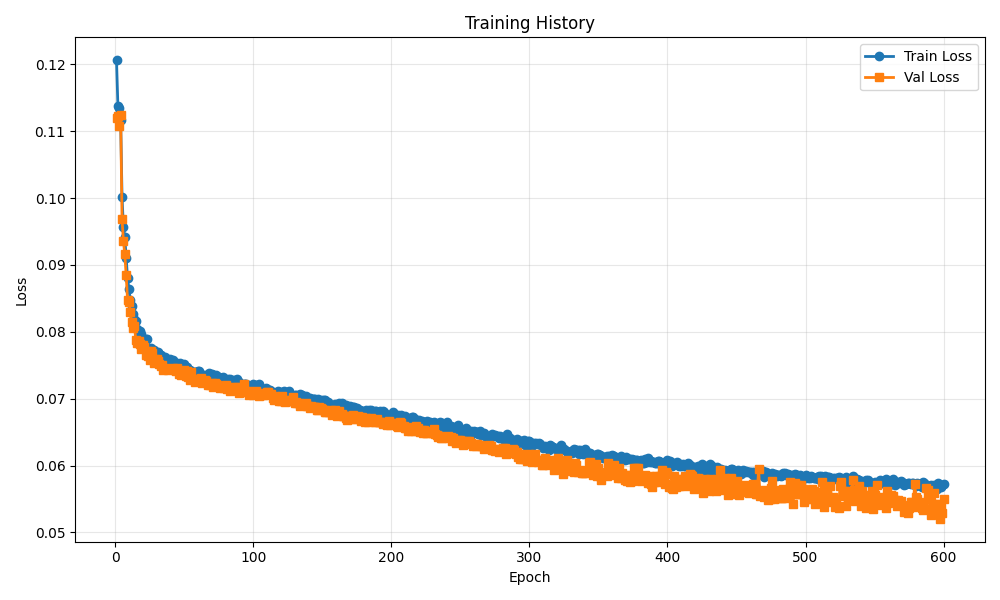
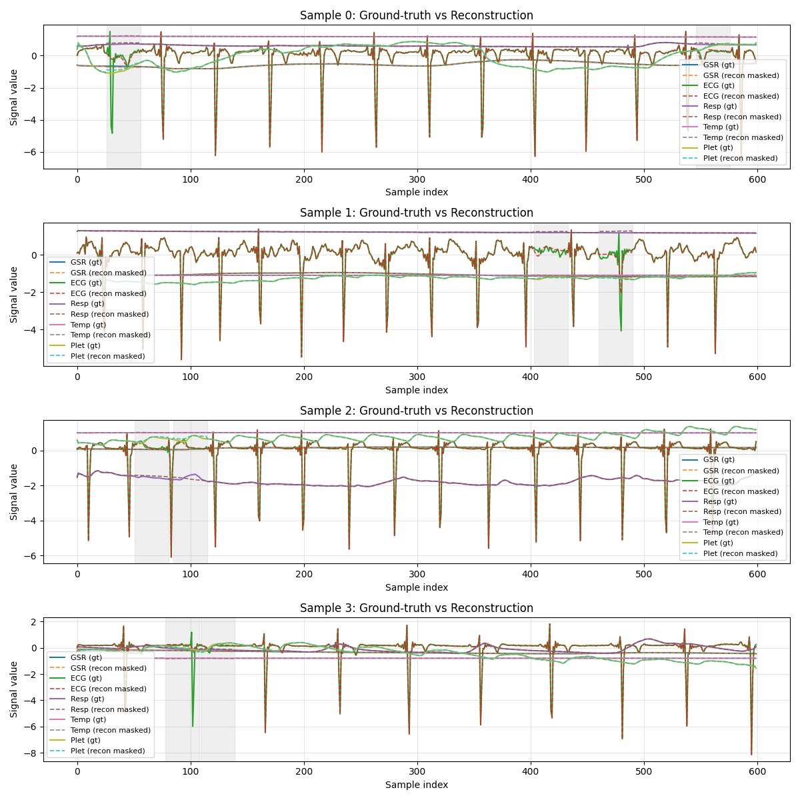

# Training Run Report

**Date:** 2025-12-28 23:34:36

## 💡 Notes / Goal

shared mask

## 🚀 Command

```bash
main.py --use-eatmint --epochs 600 --batch-size 8 --target-fs 50 --latent-dim 128 --num-latents 32 --diff-loss-weight 0.4 --no-residual --run-name shared_mask --comment shared mask --masking --mask-frac 0.1 --mask-shared-time --mask-num-spans 2
```

## ⚙️ Configuration

| Parameter | Value |
|-----------|-------|
| `batch_size` | `8` |
| `cache_to_gpu` | `False` |
| `comment` | `shared mask` |
| `data_root` | `../data/EATMINT/researchdata` |
| `decoder_len` | `None` |
| `device` | `None` |
| `diff_loss_weight` | `0.4` |
| `downsample_strategy` | `polyphase` |
| `dropout` | `0.05` |
| `epochs` | `600` |
| `fourier_bands` | `32` |
| `hop_size` | `6.0` |
| `latent_dim` | `128` |
| `lr` | `0.0001` |
| `mask_frac` | `0.1` |
| `mask_num_spans` | `2` |
| `mask_per_channel` | `False` |
| `mask_shared_time` | `True` |
| `masking` | `True` |
| `max_freq_hz` | `None` |
| `min_freq_hz` | `None` |
| `no_residual` | `True` |
| `num_heads` | `8` |
| `num_latents` | `32` |
| `num_signals` | `5` |
| `num_windows` | `200` |
| `num_workers` | `0` |
| `physio_fs` | `512.0` |
| `preload` | `True` |
| `run_name` | `shared_mask` |
| `seed` | `0` |
| `self_layers` | `4` |
| `smoothing_kernel` | `0` |
| `target_fs` | `50.0` |
| `use_eatmint` | `True` |
| `val_fraction` | `0.1` |
| `window_size` | `12.0` |

## 📊 Training Results

- **Final Train Loss:** 0.057221
- **Final Val Loss:** 0.055003
- **Best Train Loss:** 0.056552
- **Best Val Loss:** 0.052048
- **Total Epochs:** 600

### Epoch-by-Epoch History

| Epoch | Train Loss | Val Loss |
|-------|------------|----------|
| 1 | 0.120608 | 0.111965 |
| 2 | 0.113841 | 0.112243 |
| 3 | 0.113463 | 0.110789 |
| 4 | 0.111662 | 0.112440 |
| 5 | 0.100197 | 0.096826 |
| 6 | 0.095683 | 0.093612 |
| 7 | 0.094149 | 0.091579 |
| 8 | 0.091091 | 0.088430 |
| 9 | 0.088028 | 0.084767 |
| 10 | 0.086357 | 0.084498 |
| 11 | 0.084732 | 0.082900 |
| 12 | 0.083926 | 0.081407 |
| 13 | 0.082730 | 0.080645 |
| 14 | 0.081927 | 0.080808 |
| 15 | 0.081616 | 0.078810 |
| 16 | 0.080415 | 0.078376 |
| 17 | 0.079779 | 0.078560 |
| 18 | 0.080173 | 0.078223 |
| 19 | 0.079665 | 0.077389 |
| 20 | 0.078975 | 0.078027 |
| 21 | 0.078574 | 0.077745 |
| 22 | 0.078948 | 0.076612 |
| 23 | 0.078919 | 0.077084 |
| 24 | 0.077634 | 0.076387 |
| 25 | 0.077365 | 0.075808 |
| 26 | 0.077653 | 0.077195 |
| 27 | 0.076991 | 0.076870 |
| 28 | 0.077257 | 0.075365 |
| 29 | 0.076976 | 0.075965 |
| 30 | 0.076618 | 0.075943 |
| 31 | 0.076971 | 0.075594 |
| 32 | 0.076623 | 0.075219 |
| 33 | 0.076532 | 0.074924 |
| 34 | 0.075952 | 0.074997 |
| 35 | 0.075604 | 0.074355 |
| 36 | 0.076275 | 0.074574 |
| 37 | 0.075511 | 0.074436 |
| 38 | 0.075802 | 0.074353 |
| 39 | 0.075643 | 0.074468 |
| 40 | 0.076008 | 0.074507 |
| 41 | 0.075683 | 0.074466 |
| 42 | 0.075762 | 0.074560 |
| 43 | 0.075126 | 0.074329 |
| 44 | 0.075156 | 0.074195 |
| 45 | 0.075282 | 0.074582 |
| 46 | 0.075031 | 0.073698 |
| 47 | 0.075405 | 0.074094 |
| 48 | 0.074496 | 0.073594 |
| 49 | 0.074627 | 0.074062 |
| 50 | 0.075172 | 0.074369 |
| 51 | 0.074011 | 0.073364 |
| 52 | 0.074744 | 0.074178 |
| 53 | 0.074192 | 0.073197 |
| 54 | 0.074311 | 0.072803 |
| 55 | 0.073896 | 0.073950 |
| 56 | 0.073647 | 0.073015 |
| 57 | 0.073946 | 0.072945 |
| 58 | 0.074054 | 0.072500 |
| 59 | 0.073672 | 0.072726 |
| 60 | 0.074162 | 0.072964 |
| 61 | 0.074077 | 0.072830 |
| 62 | 0.073471 | 0.073156 |
| 63 | 0.073342 | 0.072404 |
| 64 | 0.073542 | 0.072559 |
| 65 | 0.073473 | 0.072755 |
| 66 | 0.073328 | 0.072700 |
| 67 | 0.073149 | 0.072043 |
| 68 | 0.073777 | 0.072242 |
| 69 | 0.073057 | 0.072105 |
| 70 | 0.073627 | 0.072323 |
| 71 | 0.073542 | 0.071691 |
| 72 | 0.073211 | 0.072331 |
| 73 | 0.073507 | 0.072189 |
| 74 | 0.073319 | 0.072042 |
| 75 | 0.073226 | 0.071935 |
| 76 | 0.073138 | 0.071556 |
| 77 | 0.072875 | 0.071968 |
| 78 | 0.073184 | 0.071818 |
| 79 | 0.072344 | 0.071654 |
| 80 | 0.072599 | 0.072020 |
| 81 | 0.072532 | 0.071501 |
| 82 | 0.072958 | 0.071738 |
| 83 | 0.072924 | 0.071148 |
| 84 | 0.072415 | 0.071544 |
| 85 | 0.072405 | 0.071398 |
| 86 | 0.072824 | 0.071268 |
| 87 | 0.072456 | 0.071779 |
| 88 | 0.072949 | 0.071709 |
| 89 | 0.072272 | 0.071277 |
| 90 | 0.072531 | 0.070860 |
| 91 | 0.071820 | 0.071006 |
| 92 | 0.072113 | 0.071212 |
| 93 | 0.072132 | 0.072262 |
| 94 | 0.072205 | 0.071121 |
| 95 | 0.072154 | 0.070992 |
| 96 | 0.072111 | 0.071186 |
| 97 | 0.071948 | 0.070621 |
| 98 | 0.071959 | 0.070638 |
| 99 | 0.071677 | 0.070653 |
| 100 | 0.072135 | 0.070612 |
| 101 | 0.071894 | 0.070824 |
| 102 | 0.071985 | 0.071136 |
| 103 | 0.071762 | 0.070712 |
| 104 | 0.072135 | 0.070425 |
| 105 | 0.071138 | 0.070542 |
| 106 | 0.071442 | 0.070921 |
| 107 | 0.071279 | 0.070576 |
| 108 | 0.071264 | 0.070510 |
| 109 | 0.071615 | 0.070646 |
| 110 | 0.071456 | 0.071034 |
| 111 | 0.071221 | 0.070946 |
| 112 | 0.071272 | 0.070702 |
| 113 | 0.070678 | 0.070774 |
| 114 | 0.071038 | 0.070044 |
| 115 | 0.070858 | 0.069823 |
| 116 | 0.070826 | 0.070453 |
| 117 | 0.070637 | 0.070047 |
| 118 | 0.071111 | 0.070006 |
| 119 | 0.070950 | 0.069612 |
| 120 | 0.070559 | 0.069670 |
| 121 | 0.070938 | 0.070436 |
| 122 | 0.071082 | 0.069664 |
| 123 | 0.070500 | 0.069450 |
| 124 | 0.070822 | 0.069761 |
| 125 | 0.070989 | 0.069609 |
| 126 | 0.071127 | 0.069759 |
| 127 | 0.070346 | 0.069676 |
| 128 | 0.070330 | 0.069623 |
| 129 | 0.070408 | 0.070220 |
| 130 | 0.070574 | 0.069294 |
| 131 | 0.070628 | 0.069457 |
| 132 | 0.070438 | 0.069381 |
| 133 | 0.070012 | 0.069378 |
| 134 | 0.070694 | 0.068988 |
| 135 | 0.070581 | 0.069114 |
| 136 | 0.069938 | 0.069179 |
| 137 | 0.070251 | 0.069074 |
| 138 | 0.070470 | 0.069343 |
| 139 | 0.069849 | 0.068965 |
| 140 | 0.069633 | 0.068880 |
| 141 | 0.070122 | 0.068675 |
| 142 | 0.069792 | 0.068961 |
| 143 | 0.069892 | 0.068698 |
| 144 | 0.069954 | 0.068765 |
| 145 | 0.069907 | 0.068788 |
| 146 | 0.069812 | 0.068273 |
| 147 | 0.069945 | 0.068374 |
| 148 | 0.069733 | 0.068694 |
| 149 | 0.069168 | 0.068640 |
| 150 | 0.069847 | 0.068427 |
| 151 | 0.069739 | 0.068287 |
| 152 | 0.069806 | 0.068025 |
| 153 | 0.069406 | 0.067944 |
| 154 | 0.069468 | 0.068226 |
| 155 | 0.069054 | 0.067990 |
| 156 | 0.068801 | 0.068308 |
| 157 | 0.069028 | 0.067502 |
| 158 | 0.068971 | 0.067783 |
| 159 | 0.069152 | 0.068385 |
| 160 | 0.068656 | 0.067941 |
| 161 | 0.068644 | 0.067412 |
| 162 | 0.069311 | 0.068142 |
| 163 | 0.068984 | 0.067636 |
| 164 | 0.069341 | 0.067674 |
| 165 | 0.069063 | 0.067473 |
| 166 | 0.068637 | 0.067381 |
| 167 | 0.069075 | 0.067165 |
| 168 | 0.068539 | 0.066826 |
| 169 | 0.068723 | 0.067371 |
| 170 | 0.068868 | 0.067467 |
| 171 | 0.068260 | 0.067341 |
| 172 | 0.068720 | 0.067622 |
| 173 | 0.068735 | 0.067017 |
| 174 | 0.068105 | 0.067016 |
| 175 | 0.068670 | 0.067077 |
| 176 | 0.068279 | 0.067398 |
| 177 | 0.068337 | 0.067265 |
| 178 | 0.068093 | 0.066604 |
| 179 | 0.068215 | 0.067300 |
| 180 | 0.068062 | 0.067026 |
| 181 | 0.068011 | 0.066523 |
| 182 | 0.068374 | 0.067135 |
| 183 | 0.067915 | 0.066591 |
| 184 | 0.068257 | 0.066665 |
| 185 | 0.068243 | 0.067047 |
| 186 | 0.067759 | 0.066721 |
| 187 | 0.068073 | 0.066599 |
| 188 | 0.068223 | 0.066450 |
| 189 | 0.068133 | 0.066497 |
| 190 | 0.067621 | 0.066995 |
| 191 | 0.067775 | 0.066565 |
| 192 | 0.068193 | 0.066546 |
| 193 | 0.067454 | 0.066504 |
| 194 | 0.068203 | 0.066277 |
| 195 | 0.068042 | 0.066310 |
| 196 | 0.067563 | 0.066232 |
| 197 | 0.067591 | 0.066114 |
| 198 | 0.067509 | 0.066730 |
| 199 | 0.067382 | 0.066132 |
| 200 | 0.067523 | 0.066164 |
| 201 | 0.067945 | 0.066398 |
| 202 | 0.067517 | 0.066419 |
| 203 | 0.067522 | 0.066156 |
| 204 | 0.067376 | 0.065992 |
| 205 | 0.067503 | 0.065781 |
| 206 | 0.067407 | 0.066480 |
| 207 | 0.067541 | 0.066339 |
| 208 | 0.067124 | 0.065993 |
| 209 | 0.067092 | 0.065988 |
| 210 | 0.067365 | 0.065573 |
| 211 | 0.066804 | 0.065607 |
| 212 | 0.067143 | 0.065233 |
| 213 | 0.067035 | 0.065710 |
| 214 | 0.066941 | 0.065243 |
| 215 | 0.067227 | 0.065501 |
| 216 | 0.067202 | 0.065439 |
| 217 | 0.066946 | 0.065215 |
| 218 | 0.066349 | 0.065854 |
| 219 | 0.066733 | 0.065593 |
| 220 | 0.066861 | 0.065223 |
| 221 | 0.066490 | 0.065093 |
| 222 | 0.066597 | 0.065396 |
| 223 | 0.066488 | 0.064876 |
| 224 | 0.066384 | 0.065394 |
| 225 | 0.066246 | 0.064944 |
| 226 | 0.066599 | 0.064867 |
| 227 | 0.066276 | 0.065003 |
| 228 | 0.066509 | 0.065142 |
| 229 | 0.066011 | 0.065078 |
| 230 | 0.066283 | 0.064945 |
| 231 | 0.066478 | 0.065425 |
| 232 | 0.066152 | 0.064768 |
| 233 | 0.066285 | 0.064595 |
| 234 | 0.065800 | 0.064236 |
| 235 | 0.066491 | 0.064370 |
| 236 | 0.065893 | 0.064147 |
| 237 | 0.066355 | 0.064133 |
| 238 | 0.065824 | 0.064344 |
| 239 | 0.065985 | 0.064290 |
| 240 | 0.066466 | 0.064244 |
| 241 | 0.065964 | 0.064380 |
| 242 | 0.065465 | 0.064187 |
| 243 | 0.065886 | 0.064223 |
| 244 | 0.065379 | 0.063687 |
| 245 | 0.065789 | 0.064065 |
| 246 | 0.065335 | 0.063732 |
| 247 | 0.065503 | 0.063368 |
| 248 | 0.066022 | 0.063869 |
| 249 | 0.065491 | 0.063670 |
| 250 | 0.065444 | 0.063889 |
| 251 | 0.064687 | 0.063741 |
| 252 | 0.065257 | 0.063114 |
| 253 | 0.065260 | 0.063162 |
| 254 | 0.065612 | 0.063595 |
| 255 | 0.065191 | 0.063620 |
| 256 | 0.064997 | 0.063707 |
| 257 | 0.064455 | 0.063356 |
| 258 | 0.065117 | 0.063370 |
| 259 | 0.064852 | 0.063007 |
| 260 | 0.065248 | 0.063213 |
| 261 | 0.064977 | 0.062966 |
| 262 | 0.065031 | 0.063221 |
| 263 | 0.064751 | 0.063078 |
| 264 | 0.065194 | 0.063104 |
| 265 | 0.064547 | 0.062922 |
| 266 | 0.064681 | 0.062903 |
| 267 | 0.064859 | 0.062492 |
| 268 | 0.064457 | 0.062699 |
| 269 | 0.064388 | 0.062669 |
| 270 | 0.063988 | 0.062881 |
| 271 | 0.063939 | 0.063082 |
| 272 | 0.064316 | 0.062914 |
| 273 | 0.064714 | 0.062269 |
| 274 | 0.064389 | 0.062347 |
| 275 | 0.064554 | 0.062200 |
| 276 | 0.064389 | 0.062423 |
| 277 | 0.064477 | 0.062456 |
| 278 | 0.064193 | 0.062061 |
| 279 | 0.064497 | 0.062292 |
| 280 | 0.064116 | 0.062241 |
| 281 | 0.063925 | 0.062583 |
| 282 | 0.063971 | 0.062659 |
| 283 | 0.063970 | 0.061700 |
| 284 | 0.064677 | 0.062172 |
| 285 | 0.064088 | 0.061918 |
| 286 | 0.064117 | 0.061890 |
| 287 | 0.063810 | 0.062156 |
| 288 | 0.063834 | 0.062415 |
| 289 | 0.063738 | 0.062307 |
| 290 | 0.063687 | 0.061669 |
| 291 | 0.064050 | 0.062086 |
| 292 | 0.063352 | 0.061345 |
| 293 | 0.063625 | 0.061055 |
| 294 | 0.063659 | 0.061707 |
| 295 | 0.063509 | 0.060968 |
| 296 | 0.063770 | 0.061258 |
| 297 | 0.063138 | 0.060981 |
| 298 | 0.063585 | 0.060751 |
| 299 | 0.063720 | 0.060821 |
| 300 | 0.063645 | 0.061742 |
| 301 | 0.062834 | 0.061566 |
| 302 | 0.063309 | 0.060542 |
| 303 | 0.063361 | 0.061484 |
| 304 | 0.063250 | 0.061806 |
| 305 | 0.063455 | 0.060898 |
| 306 | 0.063164 | 0.060508 |
| 307 | 0.063409 | 0.060791 |
| 308 | 0.063172 | 0.060780 |
| 309 | 0.062937 | 0.060105 |
| 310 | 0.062600 | 0.060129 |
| 311 | 0.062876 | 0.061142 |
| 312 | 0.062591 | 0.060679 |
| 313 | 0.062679 | 0.060447 |
| 314 | 0.062382 | 0.060103 |
| 315 | 0.063140 | 0.060890 |
| 316 | 0.062966 | 0.060323 |
| 317 | 0.062780 | 0.060449 |
| 318 | 0.062588 | 0.059418 |
| 319 | 0.062515 | 0.060530 |
| 320 | 0.062690 | 0.060170 |
| 321 | 0.062554 | 0.061171 |
| 322 | 0.062586 | 0.060000 |
| 323 | 0.063054 | 0.060479 |
| 324 | 0.062474 | 0.058708 |
| 325 | 0.062491 | 0.060169 |
| 326 | 0.062262 | 0.060542 |
| 327 | 0.061969 | 0.060912 |
| 328 | 0.061846 | 0.059751 |
| 329 | 0.061977 | 0.059142 |
| 330 | 0.062209 | 0.059564 |
| 331 | 0.061827 | 0.059795 |
| 332 | 0.062499 | 0.059102 |
| 333 | 0.062294 | 0.060443 |
| 334 | 0.062353 | 0.060046 |
| 335 | 0.062322 | 0.058985 |
| 336 | 0.061698 | 0.059202 |
| 337 | 0.062354 | 0.059380 |
| 338 | 0.061960 | 0.058963 |
| 339 | 0.061771 | 0.058902 |
| 340 | 0.062429 | 0.058953 |
| 341 | 0.061933 | 0.059231 |
| 342 | 0.062037 | 0.059144 |
| 343 | 0.061687 | 0.060458 |
| 344 | 0.061948 | 0.060528 |
| 345 | 0.061417 | 0.059090 |
| 346 | 0.061559 | 0.058581 |
| 347 | 0.061290 | 0.059423 |
| 348 | 0.061065 | 0.060266 |
| 349 | 0.061703 | 0.058471 |
| 350 | 0.061791 | 0.059697 |
| 351 | 0.061619 | 0.058388 |
| 352 | 0.061370 | 0.057860 |
| 353 | 0.061146 | 0.058811 |
| 354 | 0.061347 | 0.058719 |
| 355 | 0.061094 | 0.059008 |
| 356 | 0.061442 | 0.058498 |
| 357 | 0.061255 | 0.060460 |
| 358 | 0.061414 | 0.059453 |
| 359 | 0.061454 | 0.059304 |
| 360 | 0.061568 | 0.058899 |
| 361 | 0.061503 | 0.060157 |
| 362 | 0.061062 | 0.058663 |
| 363 | 0.061024 | 0.059143 |
| 364 | 0.061086 | 0.058218 |
| 365 | 0.060991 | 0.059603 |
| 366 | 0.061367 | 0.058130 |
| 367 | 0.061046 | 0.058955 |
| 368 | 0.061033 | 0.058320 |
| 369 | 0.060876 | 0.057800 |
| 370 | 0.061267 | 0.058543 |
| 371 | 0.060989 | 0.057723 |
| 372 | 0.060988 | 0.058587 |
| 373 | 0.061013 | 0.057599 |
| 374 | 0.060933 | 0.057768 |
| 375 | 0.060907 | 0.058416 |
| 376 | 0.060830 | 0.059669 |
| 377 | 0.060858 | 0.059697 |
| 378 | 0.060886 | 0.058565 |
| 379 | 0.060575 | 0.059656 |
| 380 | 0.060502 | 0.058296 |
| 381 | 0.060913 | 0.057739 |
| 382 | 0.060419 | 0.058354 |
| 383 | 0.060381 | 0.058441 |
| 384 | 0.060922 | 0.058569 |
| 385 | 0.060590 | 0.057951 |
| 386 | 0.061077 | 0.057405 |
| 387 | 0.060581 | 0.058418 |
| 388 | 0.060636 | 0.057238 |
| 389 | 0.060541 | 0.056777 |
| 390 | 0.060597 | 0.057479 |
| 391 | 0.060400 | 0.058272 |
| 392 | 0.060329 | 0.058445 |
| 393 | 0.060656 | 0.057556 |
| 394 | 0.060675 | 0.058479 |
| 395 | 0.060036 | 0.058498 |
| 396 | 0.060309 | 0.059302 |
| 397 | 0.059940 | 0.058600 |
| 398 | 0.060512 | 0.057278 |
| 399 | 0.060195 | 0.058974 |
| 400 | 0.060871 | 0.058715 |
| 401 | 0.060359 | 0.056839 |
| 402 | 0.060702 | 0.057077 |
| 403 | 0.059942 | 0.056725 |
| 404 | 0.060317 | 0.056570 |
| 405 | 0.060278 | 0.058395 |
| 406 | 0.060310 | 0.056801 |
| 407 | 0.060612 | 0.057927 |
| 408 | 0.059907 | 0.056902 |
| 409 | 0.060187 | 0.056951 |
| 410 | 0.059888 | 0.057982 |
| 411 | 0.060243 | 0.057292 |
| 412 | 0.059982 | 0.057713 |
| 413 | 0.059943 | 0.058494 |
| 414 | 0.059911 | 0.057264 |
| 415 | 0.060333 | 0.056964 |
| 416 | 0.060085 | 0.058698 |
| 417 | 0.059890 | 0.058579 |
| 418 | 0.059788 | 0.058509 |
| 419 | 0.059458 | 0.056560 |
| 420 | 0.059779 | 0.057494 |
| 421 | 0.059535 | 0.057537 |
| 422 | 0.059958 | 0.058169 |
| 423 | 0.059613 | 0.056969 |
| 424 | 0.059466 | 0.057177 |
| 425 | 0.060198 | 0.056672 |
| 426 | 0.059556 | 0.055900 |
| 427 | 0.059370 | 0.057942 |
| 428 | 0.060004 | 0.056917 |
| 429 | 0.059573 | 0.057170 |
| 430 | 0.059371 | 0.056192 |
| 431 | 0.060184 | 0.057995 |
| 432 | 0.059911 | 0.057101 |
| 433 | 0.059379 | 0.056915 |
| 434 | 0.059161 | 0.056588 |
| 435 | 0.059358 | 0.056246 |
| 436 | 0.059793 | 0.057961 |
| 437 | 0.059179 | 0.056602 |
| 438 | 0.059245 | 0.059300 |
| 439 | 0.059479 | 0.056667 |
| 440 | 0.059168 | 0.056371 |
| 441 | 0.059219 | 0.056876 |
| 442 | 0.059393 | 0.058096 |
| 443 | 0.059142 | 0.056760 |
| 444 | 0.059187 | 0.055598 |
| 445 | 0.059273 | 0.057812 |
| 446 | 0.059465 | 0.058192 |
| 447 | 0.059449 | 0.056646 |
| 448 | 0.059197 | 0.055764 |
| 449 | 0.059047 | 0.056055 |
| 450 | 0.059180 | 0.057744 |
| 451 | 0.059299 | 0.056926 |
| 452 | 0.058868 | 0.055667 |
| 453 | 0.058804 | 0.056854 |
| 454 | 0.059094 | 0.056434 |
| 455 | 0.059294 | 0.056016 |
| 456 | 0.059021 | 0.057150 |
| 457 | 0.059193 | 0.056150 |
| 458 | 0.059028 | 0.056408 |
| 459 | 0.059064 | 0.055844 |
| 460 | 0.059013 | 0.056558 |
| 461 | 0.059016 | 0.056749 |
| 462 | 0.058539 | 0.057217 |
| 463 | 0.059011 | 0.056289 |
| 464 | 0.058846 | 0.055700 |
| 465 | 0.058621 | 0.055730 |
| 466 | 0.058944 | 0.059491 |
| 467 | 0.059000 | 0.055526 |
| 468 | 0.058796 | 0.055744 |
| 469 | 0.059128 | 0.056365 |
| 470 | 0.058336 | 0.055321 |
| 471 | 0.059072 | 0.055762 |
| 472 | 0.058651 | 0.055440 |
| 473 | 0.058603 | 0.054899 |
| 474 | 0.058589 | 0.055053 |
| 475 | 0.058523 | 0.056589 |
| 476 | 0.058850 | 0.057714 |
| 477 | 0.058441 | 0.055039 |
| 478 | 0.058738 | 0.055098 |
| 479 | 0.058483 | 0.055222 |
| 480 | 0.058604 | 0.056420 |
| 481 | 0.058634 | 0.056092 |
| 482 | 0.058376 | 0.055111 |
| 483 | 0.058522 | 0.055187 |
| 484 | 0.058835 | 0.056491 |
| 485 | 0.058858 | 0.055154 |
| 486 | 0.058587 | 0.055966 |
| 487 | 0.058737 | 0.055357 |
| 488 | 0.058667 | 0.056439 |
| 489 | 0.058493 | 0.057508 |
| 490 | 0.058564 | 0.055812 |
| 491 | 0.058387 | 0.054262 |
| 492 | 0.058727 | 0.057417 |
| 493 | 0.058523 | 0.055801 |
| 494 | 0.058529 | 0.057028 |
| 495 | 0.057994 | 0.055696 |
| 496 | 0.058639 | 0.055776 |
| 497 | 0.058489 | 0.057097 |
| 498 | 0.058060 | 0.056450 |
| 499 | 0.058102 | 0.054563 |
| 500 | 0.058551 | 0.054937 |
| 501 | 0.058391 | 0.055320 |
| 502 | 0.058156 | 0.056043 |
| 503 | 0.058152 | 0.056243 |
| 504 | 0.058454 | 0.054957 |
| 505 | 0.058291 | 0.056563 |
| 506 | 0.058134 | 0.056155 |
| 507 | 0.058151 | 0.054286 |
| 508 | 0.058249 | 0.056012 |
| 509 | 0.058041 | 0.055444 |
| 510 | 0.058376 | 0.054894 |
| 511 | 0.058510 | 0.056095 |
| 512 | 0.058039 | 0.057518 |
| 513 | 0.057787 | 0.053831 |
| 514 | 0.058373 | 0.056504 |
| 515 | 0.058037 | 0.055671 |
| 516 | 0.058264 | 0.054512 |
| 517 | 0.058261 | 0.055031 |
| 518 | 0.058135 | 0.056952 |
| 519 | 0.057979 | 0.054786 |
| 520 | 0.058091 | 0.055305 |
| 521 | 0.058078 | 0.053819 |
| 522 | 0.057965 | 0.055053 |
| 523 | 0.058097 | 0.053942 |
| 524 | 0.058368 | 0.053733 |
| 525 | 0.058043 | 0.057025 |
| 526 | 0.058111 | 0.057488 |
| 527 | 0.058045 | 0.055413 |
| 528 | 0.057567 | 0.056219 |
| 529 | 0.058336 | 0.053971 |
| 530 | 0.057851 | 0.056190 |
| 531 | 0.057920 | 0.055245 |
| 532 | 0.057427 | 0.055888 |
| 533 | 0.058031 | 0.054826 |
| 534 | 0.058433 | 0.057852 |
| 535 | 0.057535 | 0.056415 |
| 536 | 0.057863 | 0.054713 |
| 537 | 0.058013 | 0.054885 |
| 538 | 0.057698 | 0.055571 |
| 539 | 0.057829 | 0.056915 |
| 540 | 0.057663 | 0.054004 |
| 541 | 0.057390 | 0.056160 |
| 542 | 0.057496 | 0.054915 |
| 543 | 0.057585 | 0.055087 |
| 544 | 0.057871 | 0.053691 |
| 545 | 0.057899 | 0.055079 |
| 546 | 0.057475 | 0.055541 |
| 547 | 0.057429 | 0.054737 |
| 548 | 0.057449 | 0.056171 |
| 549 | 0.057030 | 0.053554 |
| 550 | 0.057605 | 0.055661 |
| 551 | 0.057391 | 0.054955 |
| 552 | 0.057416 | 0.057069 |
| 553 | 0.057252 | 0.054160 |
| 554 | 0.057816 | 0.055083 |
| 555 | 0.057368 | 0.054817 |
| 556 | 0.057644 | 0.055309 |
| 557 | 0.057639 | 0.054641 |
| 558 | 0.057938 | 0.053614 |
| 559 | 0.057559 | 0.056212 |
| 560 | 0.057026 | 0.054337 |
| 561 | 0.057606 | 0.054674 |
| 562 | 0.057245 | 0.055532 |
| 563 | 0.058011 | 0.055388 |
| 564 | 0.057694 | 0.054687 |
| 565 | 0.057158 | 0.054874 |
| 566 | 0.057366 | 0.053999 |
| 567 | 0.057518 | 0.054811 |
| 568 | 0.057470 | 0.054083 |
| 569 | 0.057692 | 0.054745 |
| 570 | 0.057527 | 0.054085 |
| 571 | 0.057114 | 0.053024 |
| 572 | 0.057287 | 0.053816 |
| 573 | 0.057232 | 0.053657 |
| 574 | 0.057369 | 0.052921 |
| 575 | 0.057401 | 0.053609 |
| 576 | 0.057270 | 0.054519 |
| 577 | 0.057394 | 0.054630 |
| 578 | 0.057446 | 0.053852 |
| 579 | 0.057151 | 0.057265 |
| 580 | 0.057020 | 0.055377 |
| 581 | 0.057472 | 0.054999 |
| 582 | 0.057219 | 0.054603 |
| 583 | 0.057128 | 0.054243 |
| 584 | 0.056817 | 0.053609 |
| 585 | 0.057559 | 0.053431 |
| 586 | 0.057343 | 0.053510 |
| 587 | 0.057050 | 0.056586 |
| 588 | 0.057122 | 0.053481 |
| 589 | 0.056800 | 0.056377 |
| 590 | 0.056912 | 0.055333 |
| 591 | 0.057036 | 0.052599 |
| 592 | 0.056717 | 0.053676 |
| 593 | 0.057036 | 0.055946 |
| 594 | 0.056843 | 0.054237 |
| 595 | 0.056552 | 0.052962 |
| 596 | 0.057413 | 0.054255 |
| 597 | 0.057115 | 0.052048 |
| 598 | 0.056785 | 0.053819 |
| 599 | 0.057135 | 0.052955 |
| 600 | 0.057221 | 0.055003 |

## 📈 Additional Metrics

- **total_parameters:** 1211914

## 📷 Visualizations

### Training History



### Reconstruction Examples



## 💾 Checkpoint

Saved to: `checkpoint.pt`

## 📁 Files

- `checkpoint.pt` (14323.6 KB)
- `reconstruction.png` (433.2 KB)
- `training_history.png` (37.2 KB)
