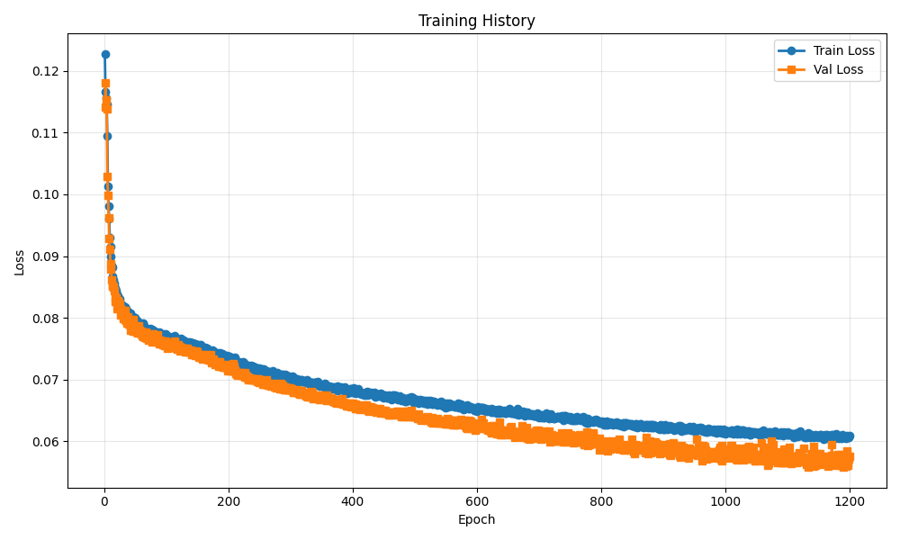
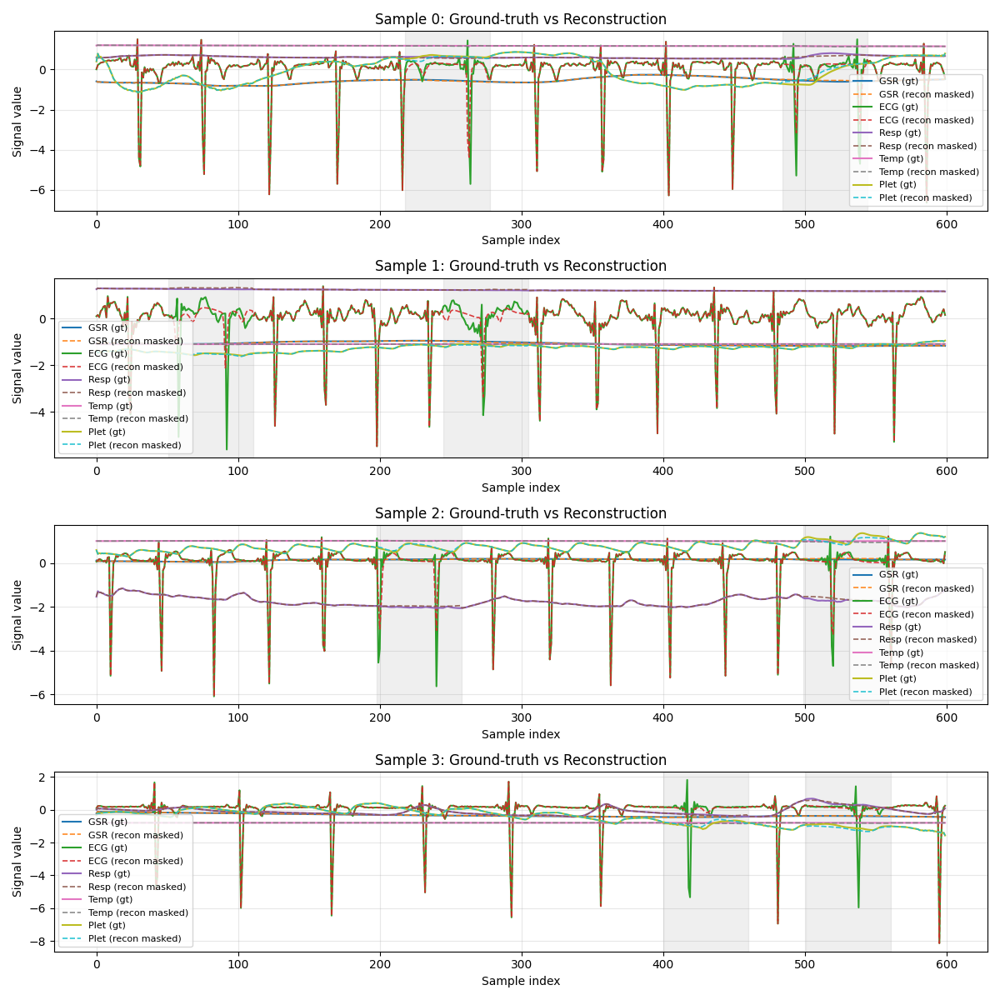

# Training Run Report

**Date:** 2025-12-29 12:21:44

## 💡 Notes / Goal

shared mask 0.2

## 🚀 Command

```bash
main.py --use-eatmint --epochs 1200 --batch-size 8 --target-fs 50 --latent-dim 128 --num-latents 32 --diff-loss-weight 0.4 --no-residual --run-name shared_mask --comment shared mask 0.2 --masking --mask-frac 0.2 --mask-shared-time --mask-num-spans 2
```

## ⚙️ Configuration

| Parameter | Value |
|-----------|-------|
| `batch_size` | `8` |
| `cache_to_gpu` | `False` |
| `comment` | `shared mask 0.2` |
| `data_root` | `../data/EATMINT/researchdata` |
| `decoder_len` | `None` |
| `device` | `None` |
| `diff_loss_weight` | `0.4` |
| `downsample_strategy` | `polyphase` |
| `dropout` | `0.05` |
| `epochs` | `1200` |
| `fourier_bands` | `32` |
| `hop_size` | `6.0` |
| `latent_dim` | `128` |
| `lr` | `0.0001` |
| `mask_frac` | `0.2` |
| `mask_num_spans` | `2` |
| `mask_per_channel` | `False` |
| `mask_shared_time` | `True` |
| `masking` | `True` |
| `max_freq_hz` | `None` |
| `min_freq_hz` | `None` |
| `no_residual` | `True` |
| `num_heads` | `8` |
| `num_latents` | `32` |
| `num_signals` | `5` |
| `num_windows` | `200` |
| `num_workers` | `0` |
| `physio_fs` | `512.0` |
| `preload` | `True` |
| `run_name` | `shared_mask` |
| `seed` | `0` |
| `self_layers` | `4` |
| `smoothing_kernel` | `0` |
| `target_fs` | `50.0` |
| `use_eatmint` | `True` |
| `val_fraction` | `0.1` |
| `window_size` | `12.0` |

## 📊 Training Results

- **Final Train Loss:** 0.060858
- **Final Val Loss:** 0.057641
- **Best Train Loss:** 0.060394
- **Best Val Loss:** 0.055851
- **Total Epochs:** 1200

### Epoch-by-Epoch History

| Epoch | Train Loss | Val Loss |
|-------|------------|----------|
| 1 | 0.122700 | 0.114100 |
| 2 | 0.116683 | 0.118121 |
| 3 | 0.115642 | 0.115261 |
| 4 | 0.114506 | 0.113870 |
| 5 | 0.109468 | 0.102921 |
| 6 | 0.101349 | 0.099893 |
| 7 | 0.098040 | 0.096220 |
| 8 | 0.096000 | 0.092917 |
| 9 | 0.092994 | 0.091160 |
| 10 | 0.091505 | 0.088805 |
| 11 | 0.089956 | 0.087898 |
| 12 | 0.088477 | 0.086174 |
| 13 | 0.088182 | 0.085248 |
| 14 | 0.086727 | 0.085054 |
| 15 | 0.086120 | 0.084911 |
| 16 | 0.085496 | 0.084341 |
| 17 | 0.084881 | 0.083381 |
| 18 | 0.084400 | 0.082609 |
| 19 | 0.084361 | 0.083295 |
| 20 | 0.083780 | 0.082290 |
| 21 | 0.083547 | 0.081474 |
| 22 | 0.083515 | 0.082723 |
| 23 | 0.082964 | 0.082206 |
| 24 | 0.082719 | 0.082473 |
| 25 | 0.083074 | 0.082159 |
| 26 | 0.082032 | 0.081501 |
| 27 | 0.082069 | 0.080413 |
| 28 | 0.082206 | 0.080908 |
| 29 | 0.081752 | 0.080883 |
| 30 | 0.081743 | 0.081145 |
| 31 | 0.081853 | 0.079837 |
| 32 | 0.081423 | 0.080061 |
| 33 | 0.081836 | 0.081208 |
| 34 | 0.081199 | 0.079797 |
| 35 | 0.081414 | 0.079632 |
| 36 | 0.080724 | 0.079177 |
| 37 | 0.080436 | 0.079380 |
| 38 | 0.081005 | 0.080215 |
| 39 | 0.080060 | 0.078998 |
| 40 | 0.080571 | 0.079003 |
| 41 | 0.079896 | 0.079220 |
| 42 | 0.080785 | 0.078044 |
| 43 | 0.079579 | 0.078728 |
| 44 | 0.079924 | 0.078621 |
| 45 | 0.079658 | 0.078279 |
| 46 | 0.079631 | 0.077794 |
| 47 | 0.080178 | 0.079742 |
| 48 | 0.079983 | 0.078496 |
| 49 | 0.079956 | 0.078214 |
| 50 | 0.079342 | 0.077778 |
| 51 | 0.079397 | 0.078098 |
| 52 | 0.079616 | 0.077685 |
| 53 | 0.078889 | 0.078516 |
| 54 | 0.079389 | 0.077612 |
| 55 | 0.078882 | 0.078658 |
| 56 | 0.078877 | 0.078001 |
| 57 | 0.078870 | 0.077918 |
| 58 | 0.079206 | 0.077541 |
| 59 | 0.078778 | 0.077382 |
| 60 | 0.078512 | 0.077862 |
| 61 | 0.078644 | 0.077082 |
| 62 | 0.079187 | 0.077324 |
| 63 | 0.078368 | 0.077009 |
| 64 | 0.078720 | 0.077063 |
| 65 | 0.078481 | 0.076872 |
| 66 | 0.077828 | 0.077209 |
| 67 | 0.078301 | 0.077736 |
| 68 | 0.078193 | 0.076612 |
| 69 | 0.078316 | 0.077094 |
| 70 | 0.078009 | 0.076984 |
| 71 | 0.077832 | 0.076310 |
| 72 | 0.078090 | 0.076653 |
| 73 | 0.078067 | 0.077039 |
| 74 | 0.078273 | 0.076566 |
| 75 | 0.077854 | 0.077354 |
| 76 | 0.077888 | 0.076737 |
| 77 | 0.078181 | 0.076098 |
| 78 | 0.077968 | 0.076494 |
| 79 | 0.077693 | 0.077409 |
| 80 | 0.077454 | 0.076279 |
| 81 | 0.077527 | 0.076267 |
| 82 | 0.077778 | 0.076475 |
| 83 | 0.077690 | 0.076454 |
| 84 | 0.077568 | 0.076164 |
| 85 | 0.077267 | 0.076708 |
| 86 | 0.077450 | 0.077257 |
| 87 | 0.077403 | 0.076302 |
| 88 | 0.077676 | 0.076122 |
| 89 | 0.076668 | 0.075865 |
| 90 | 0.077272 | 0.076390 |
| 91 | 0.077162 | 0.076163 |
| 92 | 0.077016 | 0.075860 |
| 93 | 0.076934 | 0.075763 |
| 94 | 0.077425 | 0.075689 |
| 95 | 0.077169 | 0.076267 |
| 96 | 0.077281 | 0.075913 |
| 97 | 0.077324 | 0.075500 |
| 98 | 0.076811 | 0.075585 |
| 99 | 0.077442 | 0.076235 |
| 100 | 0.076592 | 0.075862 |
| 101 | 0.077097 | 0.075970 |
| 102 | 0.076797 | 0.075081 |
| 103 | 0.077010 | 0.075429 |
| 104 | 0.077014 | 0.075352 |
| 105 | 0.076964 | 0.075664 |
| 106 | 0.076886 | 0.075287 |
| 107 | 0.076834 | 0.075390 |
| 108 | 0.076702 | 0.075554 |
| 109 | 0.076661 | 0.075979 |
| 110 | 0.076529 | 0.075883 |
| 111 | 0.076611 | 0.075564 |
| 112 | 0.076753 | 0.075223 |
| 113 | 0.076636 | 0.076193 |
| 114 | 0.077061 | 0.075474 |
| 115 | 0.076104 | 0.075246 |
| 116 | 0.076406 | 0.074999 |
| 117 | 0.076413 | 0.074928 |
| 118 | 0.076426 | 0.075169 |
| 119 | 0.076505 | 0.075611 |
| 120 | 0.076330 | 0.075193 |
| 121 | 0.076262 | 0.075314 |
| 122 | 0.076175 | 0.074617 |
| 123 | 0.076697 | 0.075275 |
| 124 | 0.076154 | 0.075228 |
| 125 | 0.075995 | 0.074978 |
| 126 | 0.076329 | 0.075007 |
| 127 | 0.076232 | 0.075097 |
| 128 | 0.076342 | 0.074784 |
| 129 | 0.076054 | 0.074857 |
| 130 | 0.075771 | 0.074450 |
| 131 | 0.075562 | 0.075101 |
| 132 | 0.076142 | 0.074906 |
| 133 | 0.075945 | 0.075043 |
| 134 | 0.075705 | 0.074524 |
| 135 | 0.076026 | 0.074832 |
| 136 | 0.075705 | 0.074513 |
| 137 | 0.075895 | 0.074679 |
| 138 | 0.076143 | 0.074586 |
| 139 | 0.075660 | 0.074712 |
| 140 | 0.075498 | 0.074534 |
| 141 | 0.075932 | 0.074063 |
| 142 | 0.075918 | 0.074137 |
| 143 | 0.075165 | 0.074160 |
| 144 | 0.075588 | 0.074062 |
| 145 | 0.075854 | 0.074419 |
| 146 | 0.075732 | 0.073962 |
| 147 | 0.075564 | 0.074048 |
| 148 | 0.075619 | 0.074694 |
| 149 | 0.075323 | 0.074540 |
| 150 | 0.075502 | 0.074074 |
| 151 | 0.075305 | 0.073945 |
| 152 | 0.075706 | 0.073900 |
| 153 | 0.075207 | 0.073603 |
| 154 | 0.075305 | 0.073740 |
| 155 | 0.074960 | 0.073635 |
| 156 | 0.075638 | 0.073640 |
| 157 | 0.074938 | 0.074081 |
| 158 | 0.074737 | 0.073388 |
| 159 | 0.075070 | 0.073693 |
| 160 | 0.074725 | 0.073769 |
| 161 | 0.075125 | 0.073557 |
| 162 | 0.075193 | 0.073459 |
| 163 | 0.074731 | 0.074105 |
| 164 | 0.074387 | 0.073341 |
| 165 | 0.075000 | 0.073247 |
| 166 | 0.075046 | 0.073506 |
| 167 | 0.074799 | 0.073675 |
| 168 | 0.074598 | 0.073298 |
| 169 | 0.074186 | 0.073174 |
| 170 | 0.074537 | 0.073286 |
| 171 | 0.074231 | 0.073184 |
| 172 | 0.074658 | 0.073974 |
| 173 | 0.074311 | 0.072734 |
| 174 | 0.074734 | 0.072806 |
| 175 | 0.074459 | 0.073247 |
| 176 | 0.074563 | 0.073152 |
| 177 | 0.074143 | 0.072686 |
| 178 | 0.074381 | 0.072378 |
| 179 | 0.074320 | 0.072890 |
| 180 | 0.074356 | 0.072577 |
| 181 | 0.074399 | 0.072401 |
| 182 | 0.074206 | 0.072653 |
| 183 | 0.074051 | 0.072588 |
| 184 | 0.074018 | 0.072863 |
| 185 | 0.073982 | 0.072221 |
| 186 | 0.074325 | 0.072950 |
| 187 | 0.073849 | 0.072126 |
| 188 | 0.074120 | 0.072432 |
| 189 | 0.074143 | 0.072140 |
| 190 | 0.074209 | 0.072364 |
| 191 | 0.073831 | 0.071967 |
| 192 | 0.074111 | 0.072258 |
| 193 | 0.073512 | 0.072050 |
| 194 | 0.073332 | 0.072263 |
| 195 | 0.073785 | 0.072072 |
| 196 | 0.073565 | 0.072443 |
| 197 | 0.073899 | 0.072132 |
| 198 | 0.073592 | 0.072037 |
| 199 | 0.073309 | 0.071481 |
| 200 | 0.073706 | 0.071673 |
| 201 | 0.073392 | 0.071588 |
| 202 | 0.073757 | 0.072205 |
| 203 | 0.073443 | 0.071418 |
| 204 | 0.073500 | 0.071364 |
| 205 | 0.073334 | 0.071868 |
| 206 | 0.073093 | 0.071971 |
| 207 | 0.073520 | 0.072539 |
| 208 | 0.073470 | 0.071953 |
| 209 | 0.073159 | 0.072141 |
| 210 | 0.073585 | 0.071325 |
| 211 | 0.072923 | 0.071494 |
| 212 | 0.073122 | 0.070942 |
| 213 | 0.072727 | 0.071080 |
| 214 | 0.072786 | 0.070879 |
| 215 | 0.072835 | 0.070699 |
| 216 | 0.072813 | 0.071171 |
| 217 | 0.072586 | 0.070903 |
| 218 | 0.072730 | 0.070881 |
| 219 | 0.072754 | 0.071152 |
| 220 | 0.072321 | 0.070918 |
| 221 | 0.072444 | 0.070667 |
| 222 | 0.072546 | 0.070804 |
| 223 | 0.072276 | 0.070646 |
| 224 | 0.072835 | 0.070658 |
| 225 | 0.072692 | 0.070710 |
| 226 | 0.072382 | 0.071136 |
| 227 | 0.072420 | 0.070467 |
| 228 | 0.072111 | 0.070667 |
| 229 | 0.072245 | 0.070575 |
| 230 | 0.072333 | 0.070346 |
| 231 | 0.072032 | 0.070225 |
| 232 | 0.072224 | 0.069892 |
| 233 | 0.072171 | 0.070158 |
| 234 | 0.072069 | 0.070043 |
| 235 | 0.072064 | 0.070281 |
| 236 | 0.072349 | 0.070101 |
| 237 | 0.072077 | 0.069973 |
| 238 | 0.072157 | 0.070066 |
| 239 | 0.072165 | 0.070065 |
| 240 | 0.072139 | 0.069935 |
| 241 | 0.071518 | 0.069963 |
| 242 | 0.071989 | 0.070023 |
| 243 | 0.072074 | 0.069953 |
| 244 | 0.071729 | 0.069940 |
| 245 | 0.071362 | 0.070040 |
| 246 | 0.071856 | 0.069859 |
| 247 | 0.071287 | 0.069647 |
| 248 | 0.071654 | 0.070043 |
| 249 | 0.071817 | 0.069926 |
| 250 | 0.071308 | 0.069528 |
| 251 | 0.071668 | 0.069663 |
| 252 | 0.071687 | 0.069612 |
| 253 | 0.071350 | 0.069745 |
| 254 | 0.071680 | 0.069463 |
| 255 | 0.071352 | 0.069496 |
| 256 | 0.071363 | 0.069164 |
| 257 | 0.071768 | 0.069231 |
| 258 | 0.071353 | 0.069419 |
| 259 | 0.071173 | 0.069412 |
| 260 | 0.071477 | 0.069281 |
| 261 | 0.071395 | 0.069993 |
| 262 | 0.071112 | 0.069357 |
| 263 | 0.070919 | 0.069267 |
| 264 | 0.071010 | 0.069152 |
| 265 | 0.071335 | 0.069221 |
| 266 | 0.071036 | 0.069139 |
| 267 | 0.071066 | 0.069309 |
| 268 | 0.070460 | 0.069085 |
| 269 | 0.071137 | 0.069012 |
| 270 | 0.071285 | 0.069018 |
| 271 | 0.070858 | 0.069023 |
| 272 | 0.071460 | 0.069044 |
| 273 | 0.070793 | 0.069392 |
| 274 | 0.070875 | 0.068788 |
| 275 | 0.070911 | 0.068877 |
| 276 | 0.070934 | 0.069025 |
| 277 | 0.070299 | 0.068691 |
| 278 | 0.071184 | 0.068870 |
| 279 | 0.071027 | 0.069080 |
| 280 | 0.070848 | 0.068736 |
| 281 | 0.070440 | 0.068641 |
| 282 | 0.070838 | 0.068615 |
| 283 | 0.070842 | 0.068436 |
| 284 | 0.070358 | 0.069343 |
| 285 | 0.070448 | 0.068476 |
| 286 | 0.070857 | 0.068922 |
| 287 | 0.070705 | 0.069068 |
| 288 | 0.070788 | 0.068565 |
| 289 | 0.070468 | 0.068717 |
| 290 | 0.070382 | 0.068327 |
| 291 | 0.070802 | 0.068289 |
| 292 | 0.070383 | 0.068823 |
| 293 | 0.070389 | 0.068434 |
| 294 | 0.070322 | 0.068414 |
| 295 | 0.070386 | 0.068418 |
| 296 | 0.070511 | 0.068578 |
| 297 | 0.070494 | 0.068382 |
| 298 | 0.069962 | 0.068463 |
| 299 | 0.070137 | 0.068633 |
| 300 | 0.070364 | 0.068577 |
| 301 | 0.070468 | 0.068304 |
| 302 | 0.069814 | 0.068489 |
| 303 | 0.070578 | 0.068200 |
| 304 | 0.069906 | 0.067928 |
| 305 | 0.070153 | 0.067917 |
| 306 | 0.070301 | 0.068259 |
| 307 | 0.069991 | 0.068061 |
| 308 | 0.070179 | 0.068172 |
| 309 | 0.070024 | 0.068059 |
| 310 | 0.069723 | 0.068354 |
| 311 | 0.070104 | 0.068065 |
| 312 | 0.069651 | 0.067855 |
| 313 | 0.069935 | 0.067981 |
| 314 | 0.069893 | 0.067787 |
| 315 | 0.069885 | 0.067589 |
| 316 | 0.069787 | 0.067671 |
| 317 | 0.069951 | 0.068024 |
| 318 | 0.069954 | 0.068208 |
| 319 | 0.069669 | 0.067671 |
| 320 | 0.069630 | 0.067769 |
| 321 | 0.069683 | 0.067770 |
| 322 | 0.069661 | 0.067924 |
| 323 | 0.069606 | 0.067659 |
| 324 | 0.069736 | 0.067737 |
| 325 | 0.069778 | 0.067341 |
| 326 | 0.069926 | 0.067827 |
| 327 | 0.069557 | 0.067337 |
| 328 | 0.069500 | 0.067248 |
| 329 | 0.069339 | 0.067406 |
| 330 | 0.069637 | 0.067439 |
| 331 | 0.069238 | 0.067373 |
| 332 | 0.069204 | 0.067198 |
| 333 | 0.069466 | 0.067324 |
| 334 | 0.069529 | 0.068066 |
| 335 | 0.069431 | 0.067787 |
| 336 | 0.069323 | 0.067068 |
| 337 | 0.069524 | 0.066965 |
| 338 | 0.069260 | 0.067144 |
| 339 | 0.069514 | 0.067233 |
| 340 | 0.069538 | 0.067363 |
| 341 | 0.069574 | 0.067359 |
| 342 | 0.069476 | 0.067356 |
| 343 | 0.069298 | 0.067014 |
| 344 | 0.069627 | 0.067259 |
| 345 | 0.069041 | 0.067421 |
| 346 | 0.068995 | 0.066824 |
| 347 | 0.069267 | 0.067471 |
| 348 | 0.069283 | 0.066923 |
| 349 | 0.069129 | 0.066873 |
| 350 | 0.069099 | 0.066901 |
| 351 | 0.068963 | 0.066904 |
| 352 | 0.069066 | 0.067041 |
| 353 | 0.069130 | 0.066902 |
| 354 | 0.068797 | 0.067161 |
| 355 | 0.069352 | 0.067177 |
| 356 | 0.069203 | 0.066717 |
| 357 | 0.068917 | 0.067112 |
| 358 | 0.068947 | 0.067477 |
| 359 | 0.068984 | 0.066661 |
| 360 | 0.068935 | 0.066690 |
| 361 | 0.068737 | 0.066921 |
| 362 | 0.068654 | 0.067106 |
| 363 | 0.068888 | 0.066802 |
| 364 | 0.068533 | 0.066716 |
| 365 | 0.068575 | 0.066723 |
| 366 | 0.068598 | 0.067052 |
| 367 | 0.068855 | 0.066883 |
| 368 | 0.068841 | 0.066441 |
| 369 | 0.068576 | 0.066557 |
| 370 | 0.068674 | 0.066398 |
| 371 | 0.068753 | 0.066454 |
| 372 | 0.068502 | 0.066344 |
| 373 | 0.068454 | 0.066401 |
| 374 | 0.068642 | 0.066240 |
| 375 | 0.068190 | 0.066528 |
| 376 | 0.068899 | 0.066294 |
| 377 | 0.068485 | 0.066814 |
| 378 | 0.068720 | 0.066332 |
| 379 | 0.068518 | 0.066677 |
| 380 | 0.068332 | 0.066239 |
| 381 | 0.068791 | 0.066192 |
| 382 | 0.068542 | 0.066457 |
| 383 | 0.068415 | 0.066877 |
| 384 | 0.068529 | 0.066310 |
| 385 | 0.068487 | 0.066030 |
| 386 | 0.068180 | 0.065990 |
| 387 | 0.068313 | 0.066216 |
| 388 | 0.068792 | 0.066166 |
| 389 | 0.068310 | 0.065992 |
| 390 | 0.068280 | 0.065760 |
| 391 | 0.067994 | 0.066015 |
| 392 | 0.067777 | 0.065714 |
| 393 | 0.068345 | 0.065805 |
| 394 | 0.068033 | 0.065834 |
| 395 | 0.068419 | 0.066180 |
| 396 | 0.068547 | 0.066232 |
| 397 | 0.068533 | 0.065628 |
| 398 | 0.067947 | 0.066081 |
| 399 | 0.068296 | 0.065969 |
| 400 | 0.067925 | 0.065899 |
| 401 | 0.068517 | 0.066118 |
| 402 | 0.068581 | 0.065686 |
| 403 | 0.068066 | 0.065566 |
| 404 | 0.067814 | 0.065268 |
| 405 | 0.068386 | 0.066060 |
| 406 | 0.068146 | 0.065353 |
| 407 | 0.068352 | 0.065805 |
| 408 | 0.068018 | 0.065677 |
| 409 | 0.068491 | 0.065472 |
| 410 | 0.068032 | 0.065336 |
| 411 | 0.067800 | 0.065513 |
| 412 | 0.067837 | 0.065169 |
| 413 | 0.067916 | 0.065783 |
| 414 | 0.067906 | 0.065630 |
| 415 | 0.067661 | 0.065361 |
| 416 | 0.067627 | 0.065254 |
| 417 | 0.067831 | 0.065809 |
| 418 | 0.067685 | 0.065317 |
| 419 | 0.067458 | 0.065348 |
| 420 | 0.067755 | 0.065279 |
| 421 | 0.067956 | 0.065600 |
| 422 | 0.067842 | 0.065899 |
| 423 | 0.067551 | 0.065574 |
| 424 | 0.068020 | 0.065583 |
| 425 | 0.067774 | 0.065015 |
| 426 | 0.067823 | 0.064921 |
| 427 | 0.067662 | 0.065560 |
| 428 | 0.067603 | 0.065406 |
| 429 | 0.067794 | 0.065611 |
| 430 | 0.067899 | 0.064944 |
| 431 | 0.067798 | 0.064968 |
| 432 | 0.067709 | 0.065398 |
| 433 | 0.067567 | 0.065016 |
| 434 | 0.067459 | 0.065023 |
| 435 | 0.067878 | 0.065021 |
| 436 | 0.067241 | 0.065067 |
| 437 | 0.067451 | 0.065043 |
| 438 | 0.067582 | 0.064660 |
| 439 | 0.067447 | 0.065043 |
| 440 | 0.067557 | 0.065107 |
| 441 | 0.067639 | 0.065244 |
| 442 | 0.067470 | 0.064878 |
| 443 | 0.067287 | 0.065020 |
| 444 | 0.067318 | 0.065330 |
| 445 | 0.067763 | 0.064595 |
| 446 | 0.067440 | 0.064734 |
| 447 | 0.067643 | 0.064896 |
| 448 | 0.067322 | 0.064891 |
| 449 | 0.067124 | 0.065032 |
| 450 | 0.066988 | 0.064819 |
| 451 | 0.067233 | 0.064608 |
| 452 | 0.067496 | 0.064699 |
| 453 | 0.067386 | 0.065001 |
| 454 | 0.067199 | 0.064498 |
| 455 | 0.067077 | 0.064522 |
| 456 | 0.067028 | 0.064524 |
| 457 | 0.067295 | 0.064770 |
| 458 | 0.067133 | 0.064286 |
| 459 | 0.067555 | 0.064672 |
| 460 | 0.067393 | 0.064505 |
| 461 | 0.066892 | 0.064286 |
| 462 | 0.066804 | 0.064657 |
| 463 | 0.067285 | 0.064559 |
| 464 | 0.067420 | 0.064394 |
| 465 | 0.067470 | 0.064542 |
| 466 | 0.067152 | 0.064417 |
| 467 | 0.067073 | 0.064287 |
| 468 | 0.067465 | 0.064656 |
| 469 | 0.066994 | 0.064553 |
| 470 | 0.067300 | 0.064553 |
| 471 | 0.067185 | 0.064811 |
| 472 | 0.067116 | 0.064513 |
| 473 | 0.066789 | 0.064504 |
| 474 | 0.067074 | 0.064781 |
| 475 | 0.067203 | 0.064794 |
| 476 | 0.067277 | 0.064413 |
| 477 | 0.067042 | 0.064331 |
| 478 | 0.066606 | 0.063954 |
| 479 | 0.066971 | 0.064131 |
| 480 | 0.066963 | 0.064348 |
| 481 | 0.066847 | 0.064024 |
| 482 | 0.067103 | 0.064096 |
| 483 | 0.066819 | 0.064125 |
| 484 | 0.066405 | 0.064225 |
| 485 | 0.066796 | 0.064814 |
| 486 | 0.066508 | 0.064183 |
| 487 | 0.066723 | 0.064817 |
| 488 | 0.066762 | 0.064292 |
| 489 | 0.066668 | 0.064091 |
| 490 | 0.067102 | 0.064018 |
| 491 | 0.067076 | 0.064250 |
| 492 | 0.066836 | 0.063992 |
| 493 | 0.066848 | 0.064163 |
| 494 | 0.067173 | 0.065029 |
| 495 | 0.066749 | 0.064636 |
| 496 | 0.066685 | 0.064195 |
| 497 | 0.066326 | 0.064471 |
| 498 | 0.067025 | 0.063997 |
| 499 | 0.066625 | 0.064263 |
| 500 | 0.066491 | 0.064283 |
| 501 | 0.066652 | 0.063926 |
| 502 | 0.066816 | 0.064284 |
| 503 | 0.066534 | 0.064247 |
| 504 | 0.066576 | 0.063846 |
| 505 | 0.066754 | 0.063710 |
| 506 | 0.066205 | 0.064396 |
| 507 | 0.066381 | 0.063648 |
| 508 | 0.066398 | 0.063660 |
| 509 | 0.066736 | 0.063861 |
| 510 | 0.066648 | 0.063822 |
| 511 | 0.066417 | 0.063447 |
| 512 | 0.066548 | 0.063862 |
| 513 | 0.066496 | 0.063883 |
| 514 | 0.066592 | 0.063852 |
| 515 | 0.066237 | 0.063644 |
| 516 | 0.066584 | 0.063707 |
| 517 | 0.066408 | 0.063576 |
| 518 | 0.066137 | 0.063565 |
| 519 | 0.066177 | 0.063465 |
| 520 | 0.066555 | 0.063909 |
| 521 | 0.065967 | 0.064021 |
| 522 | 0.066528 | 0.063350 |
| 523 | 0.066335 | 0.063587 |
| 524 | 0.066453 | 0.063653 |
| 525 | 0.066646 | 0.063559 |
| 526 | 0.066339 | 0.063055 |
| 527 | 0.066287 | 0.063497 |
| 528 | 0.066084 | 0.063799 |
| 529 | 0.066027 | 0.063582 |
| 530 | 0.066473 | 0.062954 |
| 531 | 0.066400 | 0.063224 |
| 532 | 0.066312 | 0.063244 |
| 533 | 0.066079 | 0.063390 |
| 534 | 0.066327 | 0.063357 |
| 535 | 0.066147 | 0.063074 |
| 536 | 0.066007 | 0.063660 |
| 537 | 0.065906 | 0.063023 |
| 538 | 0.066110 | 0.063451 |
| 539 | 0.065966 | 0.063084 |
| 540 | 0.066308 | 0.063070 |
| 541 | 0.065960 | 0.063030 |
| 542 | 0.066452 | 0.063412 |
| 543 | 0.065996 | 0.062991 |
| 544 | 0.066116 | 0.063125 |
| 545 | 0.066002 | 0.062967 |
| 546 | 0.065696 | 0.063323 |
| 547 | 0.066203 | 0.063123 |
| 548 | 0.066092 | 0.063329 |
| 549 | 0.065732 | 0.062870 |
| 550 | 0.065484 | 0.063113 |
| 551 | 0.066230 | 0.062884 |
| 552 | 0.066058 | 0.063679 |
| 553 | 0.066018 | 0.063248 |
| 554 | 0.065565 | 0.063510 |
| 555 | 0.066232 | 0.062816 |
| 556 | 0.065861 | 0.063399 |
| 557 | 0.065756 | 0.063396 |
| 558 | 0.066099 | 0.062922 |
| 559 | 0.065667 | 0.062975 |
| 560 | 0.065758 | 0.063326 |
| 561 | 0.065891 | 0.062726 |
| 562 | 0.065952 | 0.063268 |
| 563 | 0.065703 | 0.063395 |
| 564 | 0.065592 | 0.062692 |
| 565 | 0.065634 | 0.062884 |
| 566 | 0.065789 | 0.062657 |
| 567 | 0.065524 | 0.062842 |
| 568 | 0.065758 | 0.063454 |
| 569 | 0.065891 | 0.062829 |
| 570 | 0.066111 | 0.062877 |
| 571 | 0.065418 | 0.062728 |
| 572 | 0.065739 | 0.062848 |
| 573 | 0.065637 | 0.063068 |
| 574 | 0.065452 | 0.063602 |
| 575 | 0.066014 | 0.062825 |
| 576 | 0.065820 | 0.063260 |
| 577 | 0.065732 | 0.063032 |
| 578 | 0.065489 | 0.063160 |
| 579 | 0.065134 | 0.062930 |
| 580 | 0.065313 | 0.062822 |
| 581 | 0.065368 | 0.062521 |
| 582 | 0.065596 | 0.063382 |
| 583 | 0.065674 | 0.062195 |
| 584 | 0.065854 | 0.063283 |
| 585 | 0.065460 | 0.062143 |
| 586 | 0.065677 | 0.062133 |
| 587 | 0.065258 | 0.062580 |
| 588 | 0.065351 | 0.063444 |
| 589 | 0.065475 | 0.062452 |
| 590 | 0.065580 | 0.063211 |
| 591 | 0.065311 | 0.062508 |
| 592 | 0.065427 | 0.062276 |
| 593 | 0.065329 | 0.062276 |
| 594 | 0.065485 | 0.063030 |
| 595 | 0.065253 | 0.062177 |
| 596 | 0.065074 | 0.062213 |
| 597 | 0.065265 | 0.062780 |
| 598 | 0.065189 | 0.061833 |
| 599 | 0.065355 | 0.062208 |
| 600 | 0.065511 | 0.062431 |
| 601 | 0.064916 | 0.062107 |
| 602 | 0.065528 | 0.062689 |
| 603 | 0.065279 | 0.062356 |
| 604 | 0.065499 | 0.062280 |
| 605 | 0.065093 | 0.062395 |
| 606 | 0.065403 | 0.062522 |
| 607 | 0.065263 | 0.062242 |
| 608 | 0.065449 | 0.063575 |
| 609 | 0.065372 | 0.062030 |
| 610 | 0.064960 | 0.062387 |
| 611 | 0.065456 | 0.062919 |
| 612 | 0.065039 | 0.062076 |
| 613 | 0.064958 | 0.062332 |
| 614 | 0.064981 | 0.062325 |
| 615 | 0.065235 | 0.062130 |
| 616 | 0.064927 | 0.062071 |
| 617 | 0.065054 | 0.062377 |
| 618 | 0.065007 | 0.061824 |
| 619 | 0.065063 | 0.061975 |
| 620 | 0.065081 | 0.062277 |
| 621 | 0.065139 | 0.062397 |
| 622 | 0.064912 | 0.061679 |
| 623 | 0.065243 | 0.061780 |
| 624 | 0.064682 | 0.061418 |
| 625 | 0.064829 | 0.062461 |
| 626 | 0.064785 | 0.061925 |
| 627 | 0.065086 | 0.062547 |
| 628 | 0.064893 | 0.061555 |
| 629 | 0.065040 | 0.061876 |
| 630 | 0.064915 | 0.062179 |
| 631 | 0.064901 | 0.061614 |
| 632 | 0.064641 | 0.061954 |
| 633 | 0.064716 | 0.061241 |
| 634 | 0.065110 | 0.062309 |
| 635 | 0.064650 | 0.062124 |
| 636 | 0.064631 | 0.063072 |
| 637 | 0.065209 | 0.061193 |
| 638 | 0.064995 | 0.061136 |
| 639 | 0.064720 | 0.061625 |
| 640 | 0.064789 | 0.061862 |
| 641 | 0.064675 | 0.061103 |
| 642 | 0.064851 | 0.061698 |
| 643 | 0.064813 | 0.061327 |
| 644 | 0.064968 | 0.061818 |
| 645 | 0.064635 | 0.061511 |
| 646 | 0.064901 | 0.061732 |
| 647 | 0.064548 | 0.061734 |
| 648 | 0.065057 | 0.061128 |
| 649 | 0.065056 | 0.061351 |
| 650 | 0.064719 | 0.061300 |
| 651 | 0.065007 | 0.061279 |
| 652 | 0.064655 | 0.061794 |
| 653 | 0.065258 | 0.061296 |
| 654 | 0.065062 | 0.062177 |
| 655 | 0.064630 | 0.061387 |
| 656 | 0.064690 | 0.062318 |
| 657 | 0.064638 | 0.061037 |
| 658 | 0.064624 | 0.061635 |
| 659 | 0.064873 | 0.061306 |
| 660 | 0.064644 | 0.061057 |
| 661 | 0.064582 | 0.060662 |
| 662 | 0.064407 | 0.061544 |
| 663 | 0.064498 | 0.061257 |
| 664 | 0.064892 | 0.061007 |
| 665 | 0.064600 | 0.061541 |
| 666 | 0.065242 | 0.060910 |
| 667 | 0.064314 | 0.061558 |
| 668 | 0.064767 | 0.060991 |
| 669 | 0.064638 | 0.060830 |
| 670 | 0.064852 | 0.060932 |
| 671 | 0.064522 | 0.060709 |
| 672 | 0.064655 | 0.061542 |
| 673 | 0.064354 | 0.062538 |
| 674 | 0.064432 | 0.060704 |
| 675 | 0.064833 | 0.061149 |
| 676 | 0.064529 | 0.061115 |
| 677 | 0.064159 | 0.061093 |
| 678 | 0.064393 | 0.061747 |
| 679 | 0.064764 | 0.061454 |
| 680 | 0.064475 | 0.062273 |
| 681 | 0.064672 | 0.061197 |
| 682 | 0.064418 | 0.060492 |
| 683 | 0.064272 | 0.061106 |
| 684 | 0.064329 | 0.060612 |
| 685 | 0.064285 | 0.060340 |
| 686 | 0.064357 | 0.060997 |
| 687 | 0.064276 | 0.061265 |
| 688 | 0.064251 | 0.060714 |
| 689 | 0.064436 | 0.061549 |
| 690 | 0.064448 | 0.061267 |
| 691 | 0.064170 | 0.061039 |
| 692 | 0.064090 | 0.061288 |
| 693 | 0.064229 | 0.060413 |
| 694 | 0.064076 | 0.061497 |
| 695 | 0.064205 | 0.061190 |
| 696 | 0.064459 | 0.061853 |
| 697 | 0.064541 | 0.061111 |
| 698 | 0.063979 | 0.061328 |
| 699 | 0.064058 | 0.061844 |
| 700 | 0.063852 | 0.060616 |
| 701 | 0.064098 | 0.061323 |
| 702 | 0.063957 | 0.060589 |
| 703 | 0.064221 | 0.060292 |
| 704 | 0.064046 | 0.061129 |
| 705 | 0.063907 | 0.060929 |
| 706 | 0.064270 | 0.060717 |
| 707 | 0.063969 | 0.061099 |
| 708 | 0.063867 | 0.061513 |
| 709 | 0.063906 | 0.061007 |
| 710 | 0.064077 | 0.061688 |
| 711 | 0.064264 | 0.060432 |
| 712 | 0.064526 | 0.061098 |
| 713 | 0.064215 | 0.061046 |
| 714 | 0.064017 | 0.060713 |
| 715 | 0.063933 | 0.060731 |
| 716 | 0.063641 | 0.060488 |
| 717 | 0.064006 | 0.061618 |
| 718 | 0.063979 | 0.059928 |
| 719 | 0.064367 | 0.060618 |
| 720 | 0.063843 | 0.060776 |
| 721 | 0.063900 | 0.061047 |
| 722 | 0.063777 | 0.060637 |
| 723 | 0.063826 | 0.060110 |
| 724 | 0.063749 | 0.060340 |
| 725 | 0.063702 | 0.060486 |
| 726 | 0.063851 | 0.060007 |
| 727 | 0.063781 | 0.060099 |
| 728 | 0.063790 | 0.060589 |
| 729 | 0.063960 | 0.060539 |
| 730 | 0.063954 | 0.060564 |
| 731 | 0.063981 | 0.060878 |
| 732 | 0.063903 | 0.060560 |
| 733 | 0.063797 | 0.060517 |
| 734 | 0.063963 | 0.060303 |
| 735 | 0.063878 | 0.060049 |
| 736 | 0.063672 | 0.061425 |
| 737 | 0.064086 | 0.060264 |
| 738 | 0.063821 | 0.060739 |
| 739 | 0.064169 | 0.059922 |
| 740 | 0.063472 | 0.060783 |
| 741 | 0.063921 | 0.060938 |
| 742 | 0.064119 | 0.060320 |
| 743 | 0.064125 | 0.059920 |
| 744 | 0.063750 | 0.061285 |
| 745 | 0.063877 | 0.061055 |
| 746 | 0.064011 | 0.060616 |
| 747 | 0.063739 | 0.061399 |
| 748 | 0.063537 | 0.060411 |
| 749 | 0.063942 | 0.060420 |
| 750 | 0.063770 | 0.060632 |
| 751 | 0.063777 | 0.061111 |
| 752 | 0.063420 | 0.060065 |
| 753 | 0.063886 | 0.060777 |
| 754 | 0.063884 | 0.060221 |
| 755 | 0.063454 | 0.060119 |
| 756 | 0.063514 | 0.059696 |
| 757 | 0.063388 | 0.059872 |
| 758 | 0.063710 | 0.060672 |
| 759 | 0.063770 | 0.059924 |
| 760 | 0.063362 | 0.060884 |
| 761 | 0.064032 | 0.060296 |
| 762 | 0.063512 | 0.060046 |
| 763 | 0.063793 | 0.060247 |
| 764 | 0.063712 | 0.059848 |
| 765 | 0.063694 | 0.059879 |
| 766 | 0.063698 | 0.061142 |
| 767 | 0.063345 | 0.060086 |
| 768 | 0.063785 | 0.060074 |
| 769 | 0.063636 | 0.059846 |
| 770 | 0.063862 | 0.060290 |
| 771 | 0.063465 | 0.059812 |
| 772 | 0.064030 | 0.060249 |
| 773 | 0.063339 | 0.059423 |
| 774 | 0.063057 | 0.059402 |
| 775 | 0.063519 | 0.059833 |
| 776 | 0.063381 | 0.059898 |
| 777 | 0.063016 | 0.061530 |
| 778 | 0.062910 | 0.060439 |
| 779 | 0.063725 | 0.059376 |
| 780 | 0.063446 | 0.059912 |
| 781 | 0.063088 | 0.060167 |
| 782 | 0.063108 | 0.059512 |
| 783 | 0.063441 | 0.059905 |
| 784 | 0.063183 | 0.060622 |
| 785 | 0.063238 | 0.060524 |
| 786 | 0.063239 | 0.059557 |
| 787 | 0.063451 | 0.061094 |
| 788 | 0.063113 | 0.061373 |
| 789 | 0.063347 | 0.059836 |
| 790 | 0.063227 | 0.059643 |
| 791 | 0.063188 | 0.060011 |
| 792 | 0.063528 | 0.060508 |
| 793 | 0.063317 | 0.059703 |
| 794 | 0.063238 | 0.059735 |
| 795 | 0.063387 | 0.059688 |
| 796 | 0.063186 | 0.060271 |
| 797 | 0.063114 | 0.060548 |
| 798 | 0.063025 | 0.058655 |
| 799 | 0.063107 | 0.059743 |
| 800 | 0.062987 | 0.059879 |
| 801 | 0.062911 | 0.059896 |
| 802 | 0.063313 | 0.059781 |
| 803 | 0.062948 | 0.059153 |
| 804 | 0.063171 | 0.058811 |
| 805 | 0.062691 | 0.059771 |
| 806 | 0.063034 | 0.059219 |
| 807 | 0.063163 | 0.059546 |
| 808 | 0.062690 | 0.058959 |
| 809 | 0.063299 | 0.060005 |
| 810 | 0.062938 | 0.059486 |
| 811 | 0.062668 | 0.058499 |
| 812 | 0.062849 | 0.059802 |
| 813 | 0.063005 | 0.059154 |
| 814 | 0.062981 | 0.059625 |
| 815 | 0.063086 | 0.058707 |
| 816 | 0.063026 | 0.059531 |
| 817 | 0.062763 | 0.059452 |
| 818 | 0.062942 | 0.060088 |
| 819 | 0.062739 | 0.059012 |
| 820 | 0.062993 | 0.059034 |
| 821 | 0.062794 | 0.059518 |
| 822 | 0.062922 | 0.059088 |
| 823 | 0.062896 | 0.058850 |
| 824 | 0.063030 | 0.059075 |
| 825 | 0.063085 | 0.059350 |
| 826 | 0.062662 | 0.059300 |
| 827 | 0.063031 | 0.059200 |
| 828 | 0.063001 | 0.059551 |
| 829 | 0.062701 | 0.058773 |
| 830 | 0.062808 | 0.060330 |
| 831 | 0.062643 | 0.059520 |
| 832 | 0.062642 | 0.059018 |
| 833 | 0.062580 | 0.059187 |
| 834 | 0.062620 | 0.058764 |
| 835 | 0.062914 | 0.058890 |
| 836 | 0.062354 | 0.058527 |
| 837 | 0.062936 | 0.059346 |
| 838 | 0.062867 | 0.058621 |
| 839 | 0.062999 | 0.059490 |
| 840 | 0.063032 | 0.058723 |
| 841 | 0.062990 | 0.059310 |
| 842 | 0.062635 | 0.058744 |
| 843 | 0.062714 | 0.058893 |
| 844 | 0.062878 | 0.059052 |
| 845 | 0.062780 | 0.059366 |
| 846 | 0.062775 | 0.058843 |
| 847 | 0.062609 | 0.058581 |
| 848 | 0.062860 | 0.059227 |
| 849 | 0.062593 | 0.058734 |
| 850 | 0.062769 | 0.060393 |
| 851 | 0.062659 | 0.059053 |
| 852 | 0.062695 | 0.058321 |
| 853 | 0.062476 | 0.058571 |
| 854 | 0.062402 | 0.057946 |
| 855 | 0.062572 | 0.059463 |
| 856 | 0.062773 | 0.059288 |
| 857 | 0.062776 | 0.058594 |
| 858 | 0.062295 | 0.059211 |
| 859 | 0.062327 | 0.058668 |
| 860 | 0.062460 | 0.059047 |
| 861 | 0.062608 | 0.058555 |
| 862 | 0.062399 | 0.058765 |
| 863 | 0.062781 | 0.058688 |
| 864 | 0.062835 | 0.058829 |
| 865 | 0.062335 | 0.058950 |
| 866 | 0.062605 | 0.059375 |
| 867 | 0.062537 | 0.058639 |
| 868 | 0.062391 | 0.058897 |
| 869 | 0.062210 | 0.059053 |
| 870 | 0.062553 | 0.059316 |
| 871 | 0.062603 | 0.058124 |
| 872 | 0.062500 | 0.059221 |
| 873 | 0.062681 | 0.060647 |
| 874 | 0.062649 | 0.059042 |
| 875 | 0.062385 | 0.058991 |
| 876 | 0.062264 | 0.058054 |
| 877 | 0.062636 | 0.058630 |
| 878 | 0.062374 | 0.059178 |
| 879 | 0.062670 | 0.060120 |
| 880 | 0.062227 | 0.058154 |
| 881 | 0.062639 | 0.058963 |
| 882 | 0.062602 | 0.059525 |
| 883 | 0.062236 | 0.058683 |
| 884 | 0.062206 | 0.059930 |
| 885 | 0.062695 | 0.058973 |
| 886 | 0.062402 | 0.059612 |
| 887 | 0.062461 | 0.059943 |
| 888 | 0.062509 | 0.058361 |
| 889 | 0.062436 | 0.059066 |
| 890 | 0.062169 | 0.059564 |
| 891 | 0.062318 | 0.059088 |
| 892 | 0.062045 | 0.058600 |
| 893 | 0.062423 | 0.058699 |
| 894 | 0.062031 | 0.058027 |
| 895 | 0.061893 | 0.059070 |
| 896 | 0.062714 | 0.058251 |
| 897 | 0.062277 | 0.058427 |
| 898 | 0.062504 | 0.058506 |
| 899 | 0.062328 | 0.058774 |
| 900 | 0.062015 | 0.058648 |
| 901 | 0.061950 | 0.059222 |
| 902 | 0.062500 | 0.058429 |
| 903 | 0.061923 | 0.059015 |
| 904 | 0.062611 | 0.059475 |
| 905 | 0.062350 | 0.058520 |
| 906 | 0.062194 | 0.059166 |
| 907 | 0.061966 | 0.058128 |
| 908 | 0.062324 | 0.059290 |
| 909 | 0.062243 | 0.059240 |
| 910 | 0.062597 | 0.057930 |
| 911 | 0.062216 | 0.059605 |
| 912 | 0.062434 | 0.057763 |
| 913 | 0.062381 | 0.058553 |
| 914 | 0.062096 | 0.058866 |
| 915 | 0.062425 | 0.058444 |
| 916 | 0.061993 | 0.058664 |
| 917 | 0.062125 | 0.059827 |
| 918 | 0.061805 | 0.058156 |
| 919 | 0.062253 | 0.059266 |
| 920 | 0.062264 | 0.059001 |
| 921 | 0.062138 | 0.058085 |
| 922 | 0.061992 | 0.058330 |
| 923 | 0.062240 | 0.058946 |
| 924 | 0.062097 | 0.058450 |
| 925 | 0.062493 | 0.058444 |
| 926 | 0.062033 | 0.058991 |
| 927 | 0.062285 | 0.057761 |
| 928 | 0.062506 | 0.057418 |
| 929 | 0.061681 | 0.059034 |
| 930 | 0.062069 | 0.059252 |
| 931 | 0.062154 | 0.058204 |
| 932 | 0.061911 | 0.058215 |
| 933 | 0.062254 | 0.059020 |
| 934 | 0.062196 | 0.058681 |
| 935 | 0.061871 | 0.058468 |
| 936 | 0.061950 | 0.058371 |
| 937 | 0.062088 | 0.058176 |
| 938 | 0.062035 | 0.058266 |
| 939 | 0.062052 | 0.058911 |
| 940 | 0.061923 | 0.057981 |
| 941 | 0.061933 | 0.057312 |
| 942 | 0.062355 | 0.058880 |
| 943 | 0.061933 | 0.058055 |
| 944 | 0.061907 | 0.058069 |
| 945 | 0.061861 | 0.058187 |
| 946 | 0.062272 | 0.058422 |
| 947 | 0.061866 | 0.058042 |
| 948 | 0.062402 | 0.058478 |
| 949 | 0.061970 | 0.058047 |
| 950 | 0.062021 | 0.058036 |
| 951 | 0.061703 | 0.057988 |
| 952 | 0.061694 | 0.058550 |
| 953 | 0.061795 | 0.058065 |
| 954 | 0.062030 | 0.060412 |
| 955 | 0.062133 | 0.057724 |
| 956 | 0.061930 | 0.058124 |
| 957 | 0.061815 | 0.059229 |
| 958 | 0.062020 | 0.059298 |
| 959 | 0.062173 | 0.058418 |
| 960 | 0.062084 | 0.058737 |
| 961 | 0.062180 | 0.058049 |
| 962 | 0.062004 | 0.057715 |
| 963 | 0.061792 | 0.056881 |
| 964 | 0.061689 | 0.059299 |
| 965 | 0.061873 | 0.057376 |
| 966 | 0.061643 | 0.058305 |
| 967 | 0.061958 | 0.059198 |
| 968 | 0.061823 | 0.057717 |
| 969 | 0.061538 | 0.058608 |
| 970 | 0.061692 | 0.057078 |
| 971 | 0.061751 | 0.058292 |
| 972 | 0.061548 | 0.057850 |
| 973 | 0.062073 | 0.057230 |
| 974 | 0.061806 | 0.057344 |
| 975 | 0.061789 | 0.057616 |
| 976 | 0.061938 | 0.058126 |
| 977 | 0.061645 | 0.057975 |
| 978 | 0.061630 | 0.058278 |
| 979 | 0.061816 | 0.057521 |
| 980 | 0.061653 | 0.058307 |
| 981 | 0.061889 | 0.057831 |
| 982 | 0.061514 | 0.057952 |
| 983 | 0.061696 | 0.058188 |
| 984 | 0.061714 | 0.058150 |
| 985 | 0.061851 | 0.058064 |
| 986 | 0.061413 | 0.058318 |
| 987 | 0.061966 | 0.057859 |
| 988 | 0.061593 | 0.057214 |
| 989 | 0.061492 | 0.058015 |
| 990 | 0.061614 | 0.058648 |
| 991 | 0.061546 | 0.057865 |
| 992 | 0.061909 | 0.059045 |
| 993 | 0.061687 | 0.057167 |
| 994 | 0.061389 | 0.056863 |
| 995 | 0.061600 | 0.059272 |
| 996 | 0.061420 | 0.058610 |
| 997 | 0.061916 | 0.057687 |
| 998 | 0.061702 | 0.057540 |
| 999 | 0.061861 | 0.057719 |
| 1000 | 0.061412 | 0.058732 |
| 1001 | 0.061248 | 0.057799 |
| 1002 | 0.061697 | 0.058139 |
| 1003 | 0.061649 | 0.058562 |
| 1004 | 0.061668 | 0.058338 |
| 1005 | 0.061707 | 0.057727 |
| 1006 | 0.061435 | 0.057707 |
| 1007 | 0.061489 | 0.057246 |
| 1008 | 0.061391 | 0.058431 |
| 1009 | 0.061399 | 0.059374 |
| 1010 | 0.061781 | 0.059331 |
| 1011 | 0.061750 | 0.057558 |
| 1012 | 0.061719 | 0.057824 |
| 1013 | 0.061255 | 0.057969 |
| 1014 | 0.061555 | 0.057969 |
| 1015 | 0.061773 | 0.057745 |
| 1016 | 0.061452 | 0.057529 |
| 1017 | 0.061528 | 0.058426 |
| 1018 | 0.061591 | 0.057116 |
| 1019 | 0.061180 | 0.057798 |
| 1020 | 0.061948 | 0.056980 |
| 1021 | 0.061458 | 0.057284 |
| 1022 | 0.061601 | 0.057288 |
| 1023 | 0.061273 | 0.058409 |
| 1024 | 0.061829 | 0.058923 |
| 1025 | 0.061407 | 0.058122 |
| 1026 | 0.061401 | 0.057203 |
| 1027 | 0.061774 | 0.058120 |
| 1028 | 0.061832 | 0.058191 |
| 1029 | 0.061468 | 0.057067 |
| 1030 | 0.061790 | 0.056931 |
| 1031 | 0.061267 | 0.058144 |
| 1032 | 0.061623 | 0.058183 |
| 1033 | 0.061253 | 0.058349 |
| 1034 | 0.061540 | 0.058441 |
| 1035 | 0.061403 | 0.057680 |
| 1036 | 0.061627 | 0.057222 |
| 1037 | 0.061183 | 0.058978 |
| 1038 | 0.061601 | 0.059133 |
| 1039 | 0.061250 | 0.058486 |
| 1040 | 0.061073 | 0.057576 |
| 1041 | 0.061057 | 0.057979 |
| 1042 | 0.061569 | 0.057187 |
| 1043 | 0.061335 | 0.058197 |
| 1044 | 0.061465 | 0.057972 |
| 1045 | 0.061300 | 0.057874 |
| 1046 | 0.061541 | 0.058992 |
| 1047 | 0.061393 | 0.057933 |
| 1048 | 0.061520 | 0.056864 |
| 1049 | 0.061327 | 0.056830 |
| 1050 | 0.061320 | 0.057864 |
| 1051 | 0.061252 | 0.057678 |
| 1052 | 0.061260 | 0.057359 |
| 1053 | 0.061300 | 0.057081 |
| 1054 | 0.061310 | 0.057723 |
| 1055 | 0.061439 | 0.057307 |
| 1056 | 0.061045 | 0.057811 |
| 1057 | 0.061356 | 0.057835 |
| 1058 | 0.061129 | 0.057307 |
| 1059 | 0.061225 | 0.059796 |
| 1060 | 0.061441 | 0.057448 |
| 1061 | 0.061266 | 0.056812 |
| 1062 | 0.061868 | 0.058531 |
| 1063 | 0.061345 | 0.057620 |
| 1064 | 0.061400 | 0.056864 |
| 1065 | 0.061177 | 0.057476 |
| 1066 | 0.061367 | 0.057163 |
| 1067 | 0.061248 | 0.057662 |
| 1068 | 0.061149 | 0.056136 |
| 1069 | 0.061468 | 0.058644 |
| 1070 | 0.061427 | 0.056332 |
| 1071 | 0.061331 | 0.057317 |
| 1072 | 0.061446 | 0.059007 |
| 1073 | 0.061439 | 0.057801 |
| 1074 | 0.061320 | 0.057363 |
| 1075 | 0.061120 | 0.059982 |
| 1076 | 0.061315 | 0.056791 |
| 1077 | 0.061195 | 0.059442 |
| 1078 | 0.060887 | 0.058211 |
| 1079 | 0.061434 | 0.057407 |
| 1080 | 0.061662 | 0.057274 |
| 1081 | 0.061193 | 0.056775 |
| 1082 | 0.061213 | 0.057172 |
| 1083 | 0.061190 | 0.058105 |
| 1084 | 0.061012 | 0.056535 |
| 1085 | 0.061021 | 0.056800 |
| 1086 | 0.061116 | 0.057369 |
| 1087 | 0.061300 | 0.058301 |
| 1088 | 0.061099 | 0.057521 |
| 1089 | 0.061064 | 0.056999 |
| 1090 | 0.061468 | 0.056576 |
| 1091 | 0.061296 | 0.056818 |
| 1092 | 0.061303 | 0.056550 |
| 1093 | 0.060895 | 0.057620 |
| 1094 | 0.061515 | 0.058768 |
| 1095 | 0.061221 | 0.056537 |
| 1096 | 0.061280 | 0.056961 |
| 1097 | 0.061355 | 0.056538 |
| 1098 | 0.061167 | 0.057534 |
| 1099 | 0.061072 | 0.057039 |
| 1100 | 0.061447 | 0.057919 |
| 1101 | 0.061068 | 0.057833 |
| 1102 | 0.061051 | 0.058575 |
| 1103 | 0.061008 | 0.059036 |
| 1104 | 0.061309 | 0.057932 |
| 1105 | 0.061181 | 0.056679 |
| 1106 | 0.061025 | 0.056970 |
| 1107 | 0.061050 | 0.056358 |
| 1108 | 0.061232 | 0.056666 |
| 1109 | 0.061185 | 0.057137 |
| 1110 | 0.061047 | 0.057286 |
| 1111 | 0.060671 | 0.057570 |
| 1112 | 0.061030 | 0.056874 |
| 1113 | 0.061098 | 0.057571 |
| 1114 | 0.060988 | 0.056998 |
| 1115 | 0.061427 | 0.056551 |
| 1116 | 0.060836 | 0.057182 |
| 1117 | 0.061000 | 0.056702 |
| 1118 | 0.061309 | 0.057743 |
| 1119 | 0.060892 | 0.057323 |
| 1120 | 0.060853 | 0.058199 |
| 1121 | 0.061640 | 0.057912 |
| 1122 | 0.061024 | 0.058002 |
| 1123 | 0.060904 | 0.056752 |
| 1124 | 0.061224 | 0.056830 |
| 1125 | 0.061051 | 0.057142 |
| 1126 | 0.060975 | 0.058890 |
| 1127 | 0.060879 | 0.057405 |
| 1128 | 0.060657 | 0.056631 |
| 1129 | 0.061021 | 0.056879 |
| 1130 | 0.060846 | 0.057181 |
| 1131 | 0.060700 | 0.056323 |
| 1132 | 0.060961 | 0.057315 |
| 1133 | 0.061177 | 0.057496 |
| 1134 | 0.061360 | 0.055868 |
| 1135 | 0.060916 | 0.057187 |
| 1136 | 0.060859 | 0.057487 |
| 1137 | 0.060669 | 0.056332 |
| 1138 | 0.060894 | 0.057357 |
| 1139 | 0.060711 | 0.057333 |
| 1140 | 0.061035 | 0.058010 |
| 1141 | 0.060791 | 0.056446 |
| 1142 | 0.060914 | 0.059175 |
| 1143 | 0.060674 | 0.056027 |
| 1144 | 0.060944 | 0.057688 |
| 1145 | 0.060878 | 0.056077 |
| 1146 | 0.061069 | 0.056256 |
| 1147 | 0.060767 | 0.056268 |
| 1148 | 0.060878 | 0.057708 |
| 1149 | 0.060876 | 0.056681 |
| 1150 | 0.060564 | 0.057983 |
| 1151 | 0.060727 | 0.056347 |
| 1152 | 0.060973 | 0.056506 |
| 1153 | 0.061122 | 0.058029 |
| 1154 | 0.061050 | 0.056747 |
| 1155 | 0.060708 | 0.057476 |
| 1156 | 0.060832 | 0.057304 |
| 1157 | 0.060647 | 0.056879 |
| 1158 | 0.060957 | 0.056254 |
| 1159 | 0.060394 | 0.056871 |
| 1160 | 0.060921 | 0.056909 |
| 1161 | 0.061026 | 0.056506 |
| 1162 | 0.060991 | 0.057417 |
| 1163 | 0.060547 | 0.057579 |
| 1164 | 0.060696 | 0.056372 |
| 1165 | 0.061112 | 0.056875 |
| 1166 | 0.060673 | 0.055997 |
| 1167 | 0.060988 | 0.057573 |
| 1168 | 0.060646 | 0.056776 |
| 1169 | 0.060931 | 0.056342 |
| 1170 | 0.060822 | 0.056654 |
| 1171 | 0.061020 | 0.057745 |
| 1172 | 0.060747 | 0.059468 |
| 1173 | 0.060745 | 0.056997 |
| 1174 | 0.060969 | 0.057220 |
| 1175 | 0.061069 | 0.056929 |
| 1176 | 0.060878 | 0.057494 |
| 1177 | 0.060526 | 0.057180 |
| 1178 | 0.060764 | 0.057213 |
| 1179 | 0.061146 | 0.056071 |
| 1180 | 0.060665 | 0.057450 |
| 1181 | 0.060762 | 0.056844 |
| 1182 | 0.060719 | 0.057823 |
| 1183 | 0.060505 | 0.056428 |
| 1184 | 0.060617 | 0.057085 |
| 1185 | 0.060693 | 0.056116 |
| 1186 | 0.060915 | 0.057847 |
| 1187 | 0.060973 | 0.057181 |
| 1188 | 0.060438 | 0.056411 |
| 1189 | 0.061069 | 0.056673 |
| 1190 | 0.060567 | 0.055851 |
| 1191 | 0.060589 | 0.056568 |
| 1192 | 0.060731 | 0.057418 |
| 1193 | 0.060667 | 0.057080 |
| 1194 | 0.060530 | 0.057260 |
| 1195 | 0.060702 | 0.055946 |
| 1196 | 0.060937 | 0.058482 |
| 1197 | 0.060820 | 0.056159 |
| 1198 | 0.060669 | 0.056478 |
| 1199 | 0.060592 | 0.057158 |
| 1200 | 0.060858 | 0.057641 |

## 📈 Additional Metrics

- **total_parameters:** 1211914

## 📷 Visualizations

### Training History



### Reconstruction Examples



## 💾 Checkpoint

Saved to: `checkpoint.pt`

## 📁 Files

- `checkpoint.pt` (14349.4 KB)
- `reconstruction.png` (434.2 KB)
- `training_history.png` (37.9 KB)
