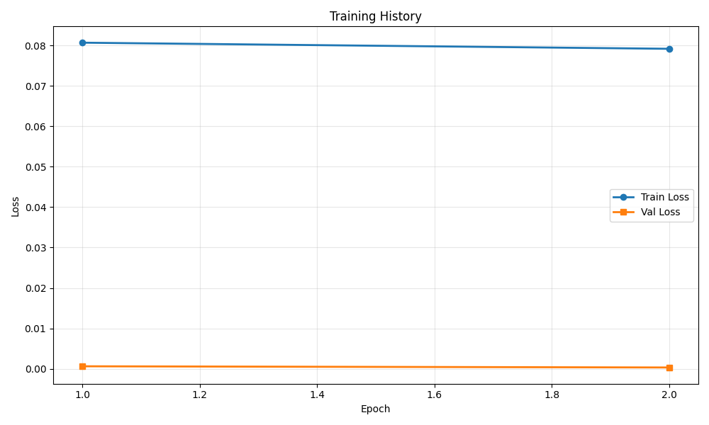
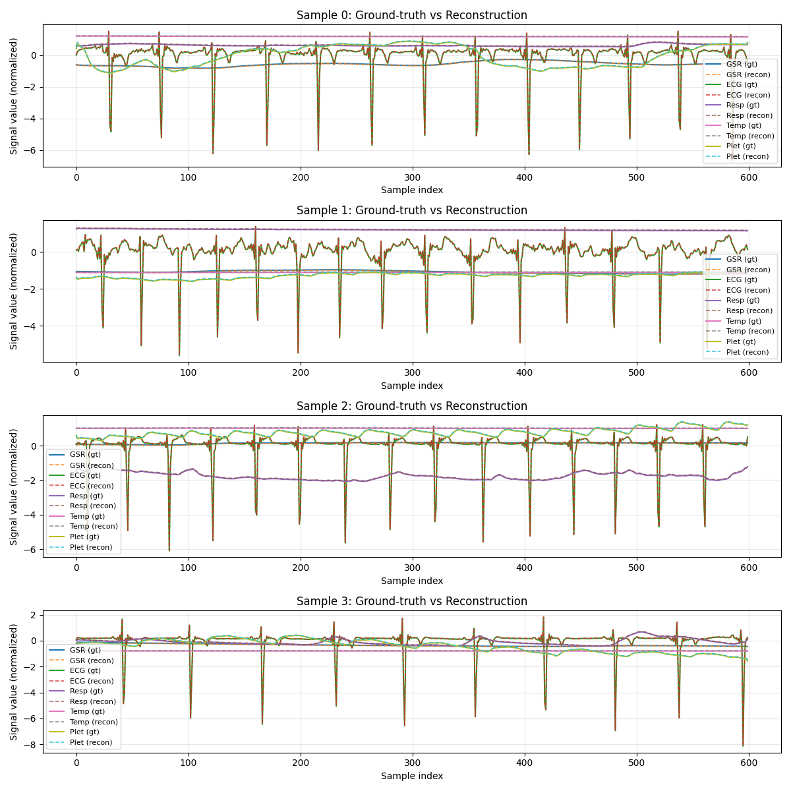

# Training Run Report

**Date:** 2025-12-05 16:00:54

## 🚀 Command

```bash
main.py --epochs 2 --batch-size 2 --num-windows 10 --run-name test_mod_drop --use-eatmint
```

## ⚙️ Configuration

| Parameter | Value |
|-----------|-------|
| `batch_size` | `2` |
| `comment` | `None` |
| `data_root` | `../data/EATMINT/researchdata` |
| `decoder_len` | `None` |
| `device` | `None` |
| `diff_loss_weight` | `0.2` |
| `downsample_strategy` | `polyphase` |
| `dropout` | `0.05` |
| `epochs` | `2` |
| `fourier_bands` | `32` |
| `hop_size` | `6.0` |
| `latent_dim` | `256` |
| `lr` | `0.0001` |
| `max_freq_hz` | `None` |
| `min_freq_hz` | `None` |
| `modality_dropout_p` | `0.2` |
| `no_residual` | `False` |
| `num_heads` | `8` |
| `num_latents` | `128` |
| `num_signals` | `5` |
| `num_windows` | `10` |
| `num_workers` | `0` |
| `physio_fs` | `512.0` |
| `preload` | `False` |
| `run_name` | `test_mod_drop` |
| `seed` | `0` |
| `self_layers` | `4` |
| `smoothing_kernel` | `0` |
| `target_fs` | `50.0` |
| `use_eatmint` | `True` |
| `val_fraction` | `0.1` |
| `window_size` | `12.0` |

## 📊 Training Results

- **Final Train Loss:** 0.079151
- **Final Val Loss:** 0.000338
- **Best Train Loss:** 0.079151
- **Best Val Loss:** 0.000338
- **Total Epochs:** 2

### Epoch-by-Epoch History

| Epoch | Train Loss | Val Loss |
|-------|------------|----------|
| 1 | 0.080663 | 0.000635 |
| 2 | 0.079151 | 0.000338 |

## 📈 Additional Metrics

- **total_parameters:** 4807685

## 📷 Visualizations

### Training History



### Reconstruction Examples



## 💾 Checkpoint

Saved to: `checkpoint.pt`

## 📁 Files

- `checkpoint.pt` (56435.3 KB)
- `reconstruction.png` (432.7 KB)
- `training_history.png` (24.4 KB)
