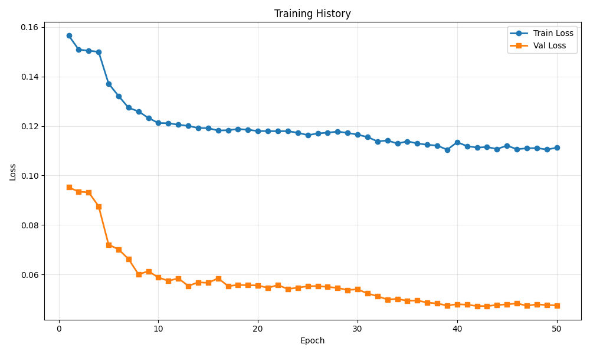
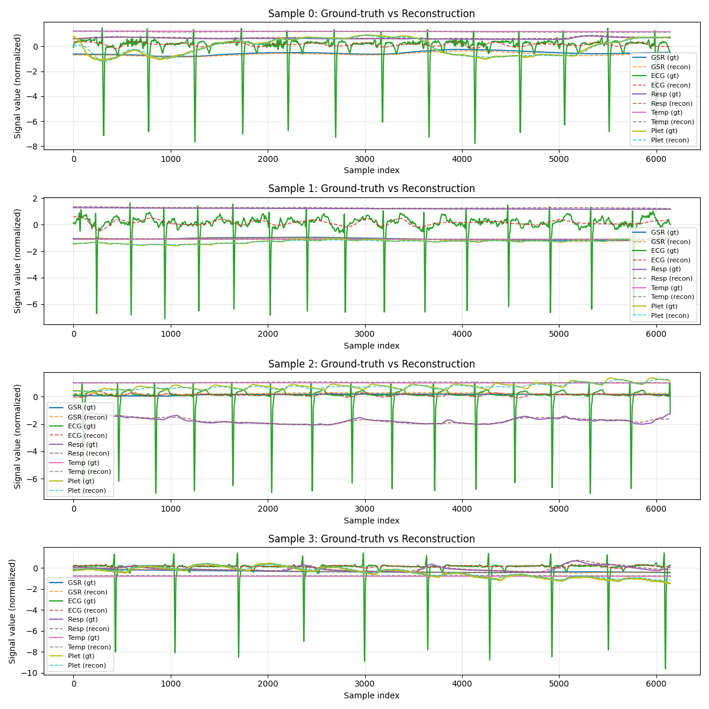

# Training Run Report

**Date:** 2025-12-06 23:45:23

## 💡 Notes / Goal

Hubert, masked modelling, 32 latent, to compare with Perceiver03 Perceiver03/runs/20251206_143458_Hubert50

## 🚀 Command

```bash
main.py --use-eatmint --epochs 50 --batch-size 8 --target-fs 512 --latent-dim 128 --num-latents 32 --diff-loss-weight 0.3 --no-residual --run-name Hubert50_MM --comment Hubert, masked modelling, 32 latent, to compare with Perceiver03 Perceiver03/runs/20251206_143458_Hubert50
```

## ⚙️ Configuration

| Parameter | Value |
|-----------|-------|
| `batch_size` | `8` |
| `comment` | `Hubert, masked modelling, 32 latent, to compare with Perceiver03 Perceiver03/runs/20251206_143458_Hubert50` |
| `data_root` | `../data/EATMINT/researchdata` |
| `decoder_len` | `None` |
| `device` | `None` |
| `diff_loss_weight` | `0.3` |
| `downsample_strategy` | `polyphase` |
| `dropout` | `0.05` |
| `epochs` | `50` |
| `fourier_bands` | `32` |
| `hop_size` | `6.0` |
| `latent_dim` | `128` |
| `lr` | `0.0001` |
| `max_freq_hz` | `None` |
| `min_freq_hz` | `None` |
| `modality_dropout_p` | `0.2` |
| `no_residual` | `True` |
| `num_heads` | `8` |
| `num_latents` | `32` |
| `num_signals` | `5` |
| `num_windows` | `200` |
| `num_workers` | `0` |
| `physio_fs` | `512.0` |
| `preload` | `False` |
| `run_name` | `Hubert50_MM` |
| `seed` | `0` |
| `self_layers` | `4` |
| `smoothing_kernel` | `0` |
| `target_fs` | `512.0` |
| `use_eatmint` | `True` |
| `val_fraction` | `0.1` |
| `window_size` | `12.0` |

## 📊 Training Results

- **Final Train Loss:** 0.111226
- **Final Val Loss:** 0.047562
- **Best Train Loss:** 0.110427
- **Best Val Loss:** 0.047280
- **Total Epochs:** 50

### Epoch-by-Epoch History

| Epoch | Train Loss | Val Loss |
|-------|------------|----------|
| 1 | 0.156501 | 0.095237 |
| 2 | 0.150830 | 0.093466 |
| 3 | 0.150392 | 0.093230 |
| 4 | 0.149934 | 0.087602 |
| 5 | 0.137108 | 0.072110 |
| 6 | 0.132124 | 0.070170 |
| 7 | 0.127390 | 0.066309 |
| 8 | 0.125873 | 0.060128 |
| 9 | 0.123230 | 0.061327 |
| 10 | 0.121192 | 0.058871 |
| 11 | 0.121108 | 0.057457 |
| 12 | 0.120503 | 0.058496 |
| 13 | 0.120024 | 0.055435 |
| 14 | 0.119182 | 0.056874 |
| 15 | 0.119115 | 0.056663 |
| 16 | 0.118159 | 0.058514 |
| 17 | 0.118300 | 0.055343 |
| 18 | 0.118762 | 0.055821 |
| 19 | 0.118488 | 0.055707 |
| 20 | 0.117954 | 0.055624 |
| 21 | 0.117924 | 0.054627 |
| 22 | 0.117883 | 0.055795 |
| 23 | 0.117895 | 0.054183 |
| 24 | 0.117272 | 0.054714 |
| 25 | 0.116298 | 0.055292 |
| 26 | 0.116973 | 0.055379 |
| 27 | 0.117316 | 0.055011 |
| 28 | 0.117722 | 0.054633 |
| 29 | 0.117217 | 0.053777 |
| 30 | 0.116495 | 0.054061 |
| 31 | 0.115536 | 0.052388 |
| 32 | 0.113784 | 0.051272 |
| 33 | 0.114146 | 0.049938 |
| 34 | 0.112906 | 0.050187 |
| 35 | 0.113805 | 0.049417 |
| 36 | 0.112953 | 0.049533 |
| 37 | 0.112406 | 0.048694 |
| 38 | 0.112092 | 0.048337 |
| 39 | 0.110427 | 0.047506 |
| 40 | 0.113438 | 0.048052 |
| 41 | 0.111872 | 0.047834 |
| 42 | 0.111264 | 0.047304 |
| 43 | 0.111517 | 0.047280 |
| 44 | 0.110707 | 0.047724 |
| 45 | 0.112048 | 0.047972 |
| 46 | 0.110641 | 0.048354 |
| 47 | 0.110983 | 0.047448 |
| 48 | 0.111099 | 0.047981 |
| 49 | 0.110485 | 0.047712 |
| 50 | 0.111226 | 0.047562 |

## 📈 Additional Metrics

- **total_parameters:** 1211909

## 📷 Visualizations

### Training History



### Reconstruction Examples



## 💾 Checkpoint

Saved to: `checkpoint.pt`

## 📁 Files

- `checkpoint.pt` (14299.0 KB)
- `reconstruction.png` (375.0 KB)
- `training_history.png` (35.6 KB)
