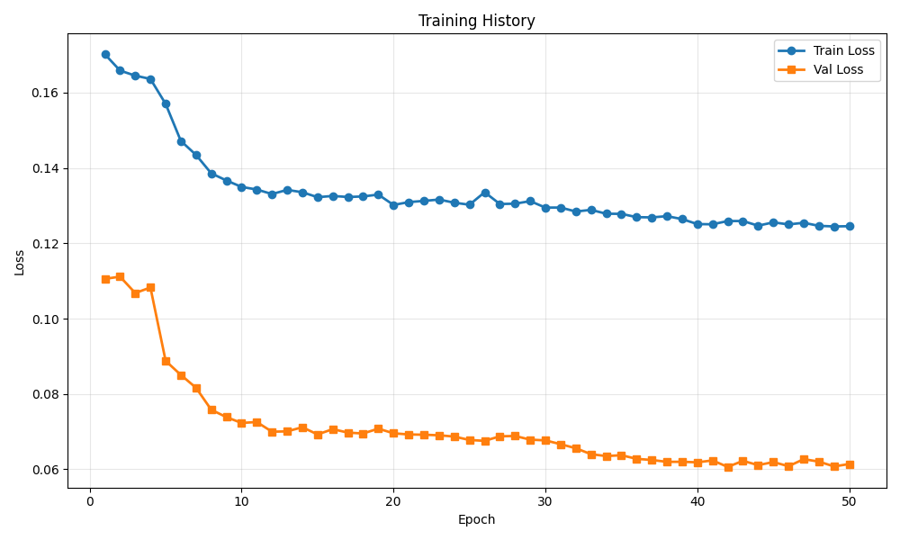
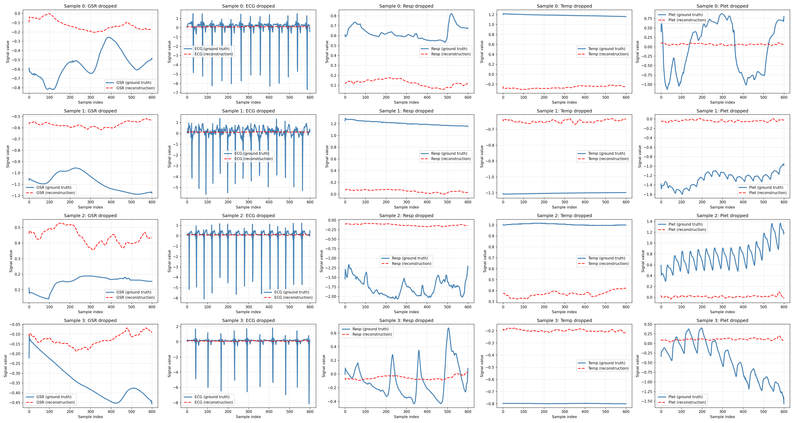

# Training Run Report

**Date:** 2025-12-08 13:44:28

## 💡 Notes / Goal

50hz

## 🚀 Command

```bash
main.py --use-eatmint --epochs 50 --batch-size 8 --target-fs 50 --latent-dim 128 --num-latents 32 --diff-loss-weight 0.3 --no-residual --run-name Hubert50 --comment 50hz
```

## ⚙️ Configuration

| Parameter | Value |
|-----------|-------|
| `batch_size` | `8` |
| `comment` | `50hz` |
| `data_root` | `../data/EATMINT/researchdata` |
| `decoder_len` | `None` |
| `device` | `None` |
| `diff_loss_weight` | `0.3` |
| `downsample_strategy` | `polyphase` |
| `dropout` | `0.05` |
| `epochs` | `50` |
| `fourier_bands` | `32` |
| `hop_size` | `6.0` |
| `latent_dim` | `128` |
| `lr` | `0.0001` |
| `max_freq_hz` | `None` |
| `min_freq_hz` | `None` |
| `modality_dropout_p` | `0.2` |
| `no_residual` | `True` |
| `num_heads` | `8` |
| `num_latents` | `32` |
| `num_signals` | `5` |
| `num_windows` | `200` |
| `num_workers` | `0` |
| `physio_fs` | `512.0` |
| `preload` | `False` |
| `run_name` | `Hubert50` |
| `seed` | `0` |
| `self_layers` | `4` |
| `smoothing_kernel` | `0` |
| `target_fs` | `50.0` |
| `use_eatmint` | `True` |
| `val_fraction` | `0.1` |
| `window_size` | `12.0` |

## 📊 Training Results

- **Final Train Loss:** 0.124535
- **Final Val Loss:** 0.061406
- **Best Train Loss:** 0.124472
- **Best Val Loss:** 0.060634
- **Total Epochs:** 50

### Epoch-by-Epoch History

| Epoch | Train Loss | Val Loss |
|-------|------------|----------|
| 1 | 0.170184 | 0.110557 |
| 2 | 0.165842 | 0.111143 |
| 3 | 0.164503 | 0.106791 |
| 4 | 0.163620 | 0.108264 |
| 5 | 0.157006 | 0.088787 |
| 6 | 0.147183 | 0.085061 |
| 7 | 0.143458 | 0.081645 |
| 8 | 0.138581 | 0.075823 |
| 9 | 0.136672 | 0.073848 |
| 10 | 0.134964 | 0.072302 |
| 11 | 0.134270 | 0.072554 |
| 12 | 0.133074 | 0.069983 |
| 13 | 0.134173 | 0.070070 |
| 14 | 0.133552 | 0.071169 |
| 15 | 0.132232 | 0.069254 |
| 16 | 0.132565 | 0.070662 |
| 17 | 0.132286 | 0.069735 |
| 18 | 0.132433 | 0.069511 |
| 19 | 0.132929 | 0.070795 |
| 20 | 0.130169 | 0.069559 |
| 21 | 0.130935 | 0.069250 |
| 22 | 0.131246 | 0.069179 |
| 23 | 0.131609 | 0.069030 |
| 24 | 0.130769 | 0.068691 |
| 25 | 0.130239 | 0.067784 |
| 26 | 0.133552 | 0.067553 |
| 27 | 0.130423 | 0.068764 |
| 28 | 0.130514 | 0.068843 |
| 29 | 0.131187 | 0.067869 |
| 30 | 0.129471 | 0.067679 |
| 31 | 0.129490 | 0.066662 |
| 32 | 0.128431 | 0.065592 |
| 33 | 0.128871 | 0.064016 |
| 34 | 0.127844 | 0.063510 |
| 35 | 0.127814 | 0.063743 |
| 36 | 0.126938 | 0.062781 |
| 37 | 0.126874 | 0.062474 |
| 38 | 0.127198 | 0.061981 |
| 39 | 0.126420 | 0.061993 |
| 40 | 0.125090 | 0.061855 |
| 41 | 0.125046 | 0.062354 |
| 42 | 0.125905 | 0.060634 |
| 43 | 0.125908 | 0.062250 |
| 44 | 0.124672 | 0.061107 |
| 45 | 0.125554 | 0.061922 |
| 46 | 0.125008 | 0.060819 |
| 47 | 0.125440 | 0.062696 |
| 48 | 0.124631 | 0.062042 |
| 49 | 0.124472 | 0.060762 |
| 50 | 0.124535 | 0.061406 |

## 📈 Additional Metrics

- **total_parameters:** 1211909

## 📷 Visualizations

### Training History



### Reconstruction Examples



## 💾 Checkpoint

Saved to: `checkpoint.pt`

## 📁 Files

- `checkpoint.pt` (14299.0 KB)
- `reconstruction.png` (1055.0 KB)
- `training_history.png` (36.1 KB)
