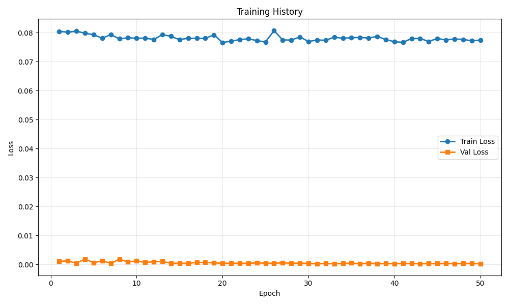
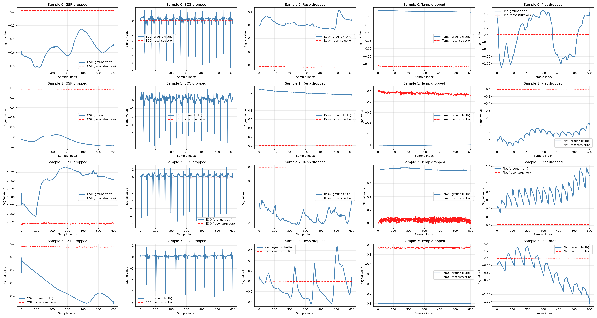

# Training Run Report

**Date:** 2025-12-08 13:56:58

## 💡 Notes / Goal

mm with residuals, 50hz

## 🚀 Command

```bash
main.py --use-eatmint --epochs 50 --batch-size 8 --target-fs 50 --latent-dim 128 --num-latents 32 --diff-loss-weight 0.3 --run-name Residuals_50zh --comment mm with residuals, 50hz
```

## ⚙️ Configuration

| Parameter | Value |
|-----------|-------|
| `batch_size` | `8` |
| `comment` | `mm with residuals, 50hz` |
| `data_root` | `../data/EATMINT/researchdata` |
| `decoder_len` | `None` |
| `device` | `None` |
| `diff_loss_weight` | `0.3` |
| `downsample_strategy` | `polyphase` |
| `dropout` | `0.05` |
| `epochs` | `50` |
| `fourier_bands` | `32` |
| `hop_size` | `6.0` |
| `latent_dim` | `128` |
| `lr` | `0.0001` |
| `max_freq_hz` | `None` |
| `min_freq_hz` | `None` |
| `modality_dropout_p` | `0.2` |
| `no_residual` | `False` |
| `num_heads` | `8` |
| `num_latents` | `32` |
| `num_signals` | `5` |
| `num_windows` | `200` |
| `num_workers` | `0` |
| `physio_fs` | `512.0` |
| `preload` | `False` |
| `run_name` | `Residuals_50zh` |
| `seed` | `0` |
| `self_layers` | `4` |
| `smoothing_kernel` | `0` |
| `target_fs` | `50.0` |
| `use_eatmint` | `True` |
| `val_fraction` | `0.1` |
| `window_size` | `12.0` |

## 📊 Training Results

- **Final Train Loss:** 0.077455
- **Final Val Loss:** 0.000257
- **Best Train Loss:** 0.076609
- **Best Val Loss:** 0.000237
- **Total Epochs:** 50

### Epoch-by-Epoch History

| Epoch | Train Loss | Val Loss |
|-------|------------|----------|
| 1 | 0.080484 | 0.001102 |
| 2 | 0.080195 | 0.001186 |
| 3 | 0.080547 | 0.000428 |
| 4 | 0.079817 | 0.001860 |
| 5 | 0.079318 | 0.000572 |
| 6 | 0.078121 | 0.001241 |
| 7 | 0.079317 | 0.000362 |
| 8 | 0.077898 | 0.001814 |
| 9 | 0.078251 | 0.000821 |
| 10 | 0.078076 | 0.001239 |
| 11 | 0.078141 | 0.000652 |
| 12 | 0.077664 | 0.000953 |
| 13 | 0.079346 | 0.001004 |
| 14 | 0.078764 | 0.000401 |
| 15 | 0.077595 | 0.000394 |
| 16 | 0.078117 | 0.000390 |
| 17 | 0.078048 | 0.000662 |
| 18 | 0.078085 | 0.000695 |
| 19 | 0.079268 | 0.000498 |
| 20 | 0.076609 | 0.000422 |
| 21 | 0.077114 | 0.000410 |
| 22 | 0.077612 | 0.000421 |
| 23 | 0.077914 | 0.000369 |
| 24 | 0.077277 | 0.000540 |
| 25 | 0.076813 | 0.000417 |
| 26 | 0.080722 | 0.000417 |
| 27 | 0.077512 | 0.000524 |
| 28 | 0.077465 | 0.000408 |
| 29 | 0.078567 | 0.000448 |
| 30 | 0.076960 | 0.000354 |
| 31 | 0.077496 | 0.000278 |
| 32 | 0.077387 | 0.000316 |
| 33 | 0.078472 | 0.000265 |
| 34 | 0.078061 | 0.000322 |
| 35 | 0.078280 | 0.000467 |
| 36 | 0.078383 | 0.000237 |
| 37 | 0.078169 | 0.000428 |
| 38 | 0.078740 | 0.000278 |
| 39 | 0.077643 | 0.000335 |
| 40 | 0.076908 | 0.000272 |
| 41 | 0.076679 | 0.000387 |
| 42 | 0.077985 | 0.000304 |
| 43 | 0.078001 | 0.000245 |
| 44 | 0.076985 | 0.000327 |
| 45 | 0.078000 | 0.000307 |
| 46 | 0.077519 | 0.000385 |
| 47 | 0.077828 | 0.000286 |
| 48 | 0.077691 | 0.000356 |
| 49 | 0.077209 | 0.000349 |
| 50 | 0.077455 | 0.000257 |

## 📈 Additional Metrics

- **total_parameters:** 1211909

## 📷 Visualizations

### Training History



### Reconstruction Examples



## 💾 Checkpoint

Saved to: `checkpoint.pt`

## 📁 Files

- `checkpoint.pt` (14299.0 KB)
- `reconstruction.png` (1030.7 KB)
- `training_history.png` (33.0 KB)
