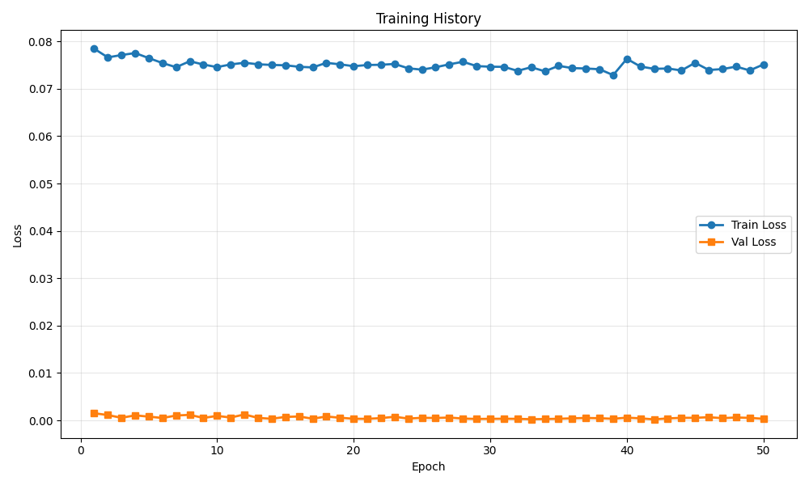
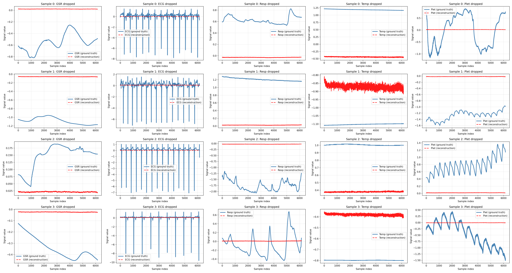

# Training Run Report

**Date:** 2025-12-08 13:55:36

## 💡 Notes / Goal

mm with residuals, 512hz

## 🚀 Command

```bash
main.py --use-eatmint --epochs 50 --batch-size 8 --target-fs 512 --latent-dim 128 --num-latents 32 --diff-loss-weight 0.3 --run-name Residuals_512hz --comment mm with residuals, 512hz
```

## ⚙️ Configuration

| Parameter | Value |
|-----------|-------|
| `batch_size` | `8` |
| `comment` | `mm with residuals, 512hz` |
| `data_root` | `../data/EATMINT/researchdata` |
| `decoder_len` | `None` |
| `device` | `None` |
| `diff_loss_weight` | `0.3` |
| `downsample_strategy` | `polyphase` |
| `dropout` | `0.05` |
| `epochs` | `50` |
| `fourier_bands` | `32` |
| `hop_size` | `6.0` |
| `latent_dim` | `128` |
| `lr` | `0.0001` |
| `max_freq_hz` | `None` |
| `min_freq_hz` | `None` |
| `modality_dropout_p` | `0.2` |
| `no_residual` | `False` |
| `num_heads` | `8` |
| `num_latents` | `32` |
| `num_signals` | `5` |
| `num_windows` | `200` |
| `num_workers` | `0` |
| `physio_fs` | `512.0` |
| `preload` | `False` |
| `run_name` | `Residuals_512hz` |
| `seed` | `0` |
| `self_layers` | `4` |
| `smoothing_kernel` | `0` |
| `target_fs` | `512.0` |
| `use_eatmint` | `True` |
| `val_fraction` | `0.1` |
| `window_size` | `12.0` |

## 📊 Training Results

- **Final Train Loss:** 0.075136
- **Final Val Loss:** 0.000333
- **Best Train Loss:** 0.072884
- **Best Val Loss:** 0.000213
- **Total Epochs:** 50

### Epoch-by-Epoch History

| Epoch | Train Loss | Val Loss |
|-------|------------|----------|
| 1 | 0.078461 | 0.001504 |
| 2 | 0.076628 | 0.001123 |
| 3 | 0.077124 | 0.000545 |
| 4 | 0.077550 | 0.001061 |
| 5 | 0.076477 | 0.000789 |
| 6 | 0.075439 | 0.000503 |
| 7 | 0.074558 | 0.001023 |
| 8 | 0.075819 | 0.001167 |
| 9 | 0.075120 | 0.000515 |
| 10 | 0.074579 | 0.000946 |
| 11 | 0.075144 | 0.000600 |
| 12 | 0.075497 | 0.001250 |
| 13 | 0.075174 | 0.000520 |
| 14 | 0.075036 | 0.000337 |
| 15 | 0.074963 | 0.000733 |
| 16 | 0.074647 | 0.000819 |
| 17 | 0.074511 | 0.000348 |
| 18 | 0.075477 | 0.000819 |
| 19 | 0.075164 | 0.000556 |
| 20 | 0.074769 | 0.000340 |
| 21 | 0.075020 | 0.000323 |
| 22 | 0.075072 | 0.000478 |
| 23 | 0.075243 | 0.000760 |
| 24 | 0.074324 | 0.000377 |
| 25 | 0.074038 | 0.000540 |
| 26 | 0.074547 | 0.000502 |
| 27 | 0.075165 | 0.000594 |
| 28 | 0.075702 | 0.000382 |
| 29 | 0.074794 | 0.000301 |
| 30 | 0.074663 | 0.000323 |
| 31 | 0.074633 | 0.000344 |
| 32 | 0.073790 | 0.000320 |
| 33 | 0.074552 | 0.000248 |
| 34 | 0.073694 | 0.000284 |
| 35 | 0.074846 | 0.000333 |
| 36 | 0.074372 | 0.000431 |
| 37 | 0.074284 | 0.000505 |
| 38 | 0.074130 | 0.000451 |
| 39 | 0.072884 | 0.000337 |
| 40 | 0.076330 | 0.000570 |
| 41 | 0.074691 | 0.000423 |
| 42 | 0.074214 | 0.000213 |
| 43 | 0.074283 | 0.000414 |
| 44 | 0.073875 | 0.000533 |
| 45 | 0.075493 | 0.000542 |
| 46 | 0.073971 | 0.000666 |
| 47 | 0.074158 | 0.000466 |
| 48 | 0.074677 | 0.000608 |
| 49 | 0.073881 | 0.000523 |
| 50 | 0.075136 | 0.000333 |

## 📈 Additional Metrics

- **total_parameters:** 1211909

## 📷 Visualizations

### Training History



### Reconstruction Examples



## 💾 Checkpoint

Saved to: `checkpoint.pt`

## 📁 Files

- `checkpoint.pt` (14299.0 KB)
- `reconstruction.png` (975.6 KB)
- `training_history.png` (32.6 KB)
