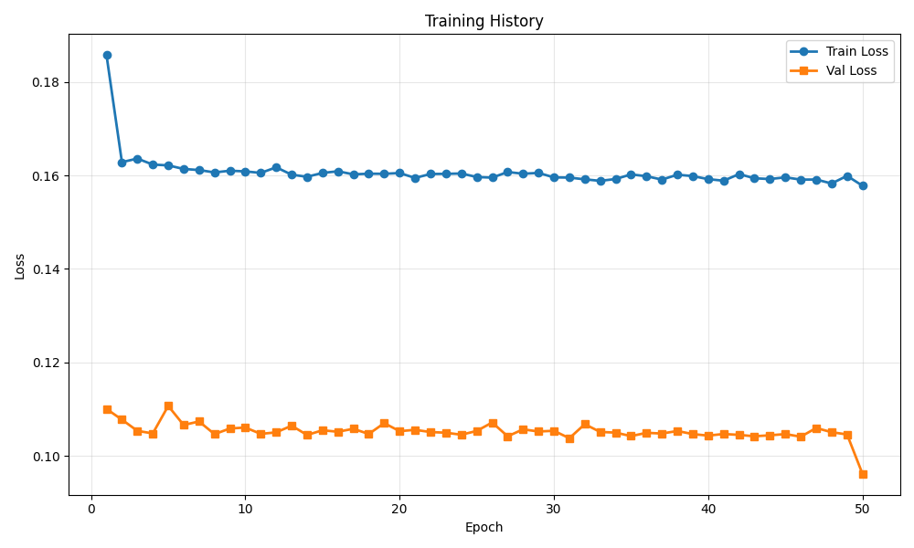
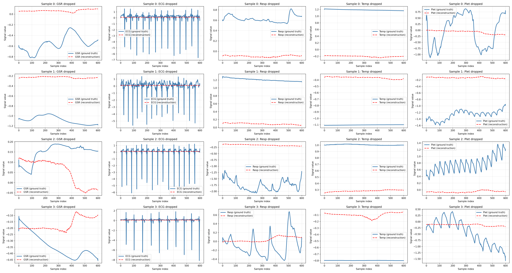

# Training Run Report

**Date:** 2025-12-08 14:19:53

## 💡 Notes / Goal

keep 7.5 ratio but invert time and dim

## 🚀 Command

```bash
main.py --use-eatmint --epochs 50 --batch-size 8 --target-fs 50 --latent-dim 32 --num-latents 128 --diff-loss-weight 0.3 --no-residual --run-name invert_ratio_nores --comment keep 7.5 ratio but invert time and dim
```

## ⚙️ Configuration

| Parameter | Value |
|-----------|-------|
| `batch_size` | `8` |
| `comment` | `keep 7.5 ratio but invert time and dim` |
| `data_root` | `../data/EATMINT/researchdata` |
| `decoder_len` | `None` |
| `device` | `None` |
| `diff_loss_weight` | `0.3` |
| `downsample_strategy` | `polyphase` |
| `dropout` | `0.05` |
| `epochs` | `50` |
| `fourier_bands` | `32` |
| `hop_size` | `6.0` |
| `latent_dim` | `32` |
| `lr` | `0.0001` |
| `max_freq_hz` | `None` |
| `min_freq_hz` | `None` |
| `modality_dropout_p` | `0.2` |
| `no_residual` | `True` |
| `num_heads` | `8` |
| `num_latents` | `128` |
| `num_signals` | `5` |
| `num_windows` | `200` |
| `num_workers` | `0` |
| `physio_fs` | `512.0` |
| `preload` | `False` |
| `run_name` | `invert_ratio_nores` |
| `seed` | `0` |
| `self_layers` | `4` |
| `smoothing_kernel` | `0` |
| `target_fs` | `50.0` |
| `use_eatmint` | `True` |
| `val_fraction` | `0.1` |
| `window_size` | `12.0` |

## 📊 Training Results

- **Final Train Loss:** 0.157785
- **Final Val Loss:** 0.096132
- **Best Train Loss:** 0.157785
- **Best Val Loss:** 0.096132
- **Total Epochs:** 50

### Epoch-by-Epoch History

| Epoch | Train Loss | Val Loss |
|-------|------------|----------|
| 1 | 0.185755 | 0.110020 |
| 2 | 0.162835 | 0.107730 |
| 3 | 0.163598 | 0.105330 |
| 4 | 0.162317 | 0.104776 |
| 5 | 0.162142 | 0.110665 |
| 6 | 0.161379 | 0.106585 |
| 7 | 0.161143 | 0.107340 |
| 8 | 0.160635 | 0.104624 |
| 9 | 0.161000 | 0.105835 |
| 10 | 0.160852 | 0.106040 |
| 11 | 0.160532 | 0.104681 |
| 12 | 0.161730 | 0.105008 |
| 13 | 0.160150 | 0.106433 |
| 14 | 0.159704 | 0.104447 |
| 15 | 0.160527 | 0.105454 |
| 16 | 0.160877 | 0.105138 |
| 17 | 0.160221 | 0.105770 |
| 18 | 0.160364 | 0.104658 |
| 19 | 0.160340 | 0.106980 |
| 20 | 0.160501 | 0.105260 |
| 21 | 0.159457 | 0.105551 |
| 22 | 0.160299 | 0.105073 |
| 23 | 0.160335 | 0.104932 |
| 24 | 0.160404 | 0.104499 |
| 25 | 0.159655 | 0.105314 |
| 26 | 0.159520 | 0.107121 |
| 27 | 0.160723 | 0.104164 |
| 28 | 0.160354 | 0.105654 |
| 29 | 0.160529 | 0.105193 |
| 30 | 0.159573 | 0.105344 |
| 31 | 0.159528 | 0.103757 |
| 32 | 0.159153 | 0.106756 |
| 33 | 0.158833 | 0.105099 |
| 34 | 0.159224 | 0.104950 |
| 35 | 0.160212 | 0.104207 |
| 36 | 0.159820 | 0.104909 |
| 37 | 0.159101 | 0.104755 |
| 38 | 0.160142 | 0.105298 |
| 39 | 0.159851 | 0.104637 |
| 40 | 0.159193 | 0.104311 |
| 41 | 0.158862 | 0.104660 |
| 42 | 0.160277 | 0.104467 |
| 43 | 0.159381 | 0.104171 |
| 44 | 0.159218 | 0.104379 |
| 45 | 0.159583 | 0.104641 |
| 46 | 0.159098 | 0.104080 |
| 47 | 0.159115 | 0.105942 |
| 48 | 0.158268 | 0.105041 |
| 49 | 0.159904 | 0.104560 |
| 50 | 0.157785 | 0.096132 |

## 📈 Additional Metrics

- **total_parameters:** 84869

## 📷 Visualizations

### Training History



### Reconstruction Examples



## 💾 Checkpoint

Saved to: `checkpoint.pt`

## 📁 Files

- `checkpoint.pt` (1091.3 KB)
- `reconstruction.png` (1027.4 KB)
- `training_history.png` (31.7 KB)
